# 编译器原理

## Introduction of Compiler

### Overview of Compiler

#### What it compiler?
Compiler is a program that can tranlate source code to another code, and **save it as executable**.
Source code: C/C++, Java, C#, HTML...
Object code: x86, ARM, MIPS...

#### What's the difference between compiler and interpreter?
An interpreter is program that reads a program and produces the results of executing that program. And will **not save the compiled executable**.

### The Structure of Compiler
Most of the compiler contains three ends: **Front End**, **Middle End**, **Back End**.
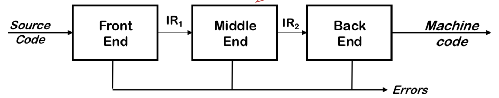
The basic workflow of a compiler:
* Front end maps legal source code into IR(intermidiate representation)
* Middle end optimizes the IR
* Back end maps IR into target machine code
* Admits multiple passes(read from the begin of the code to its end)

1. Front End
    The structure of Front End is like this
    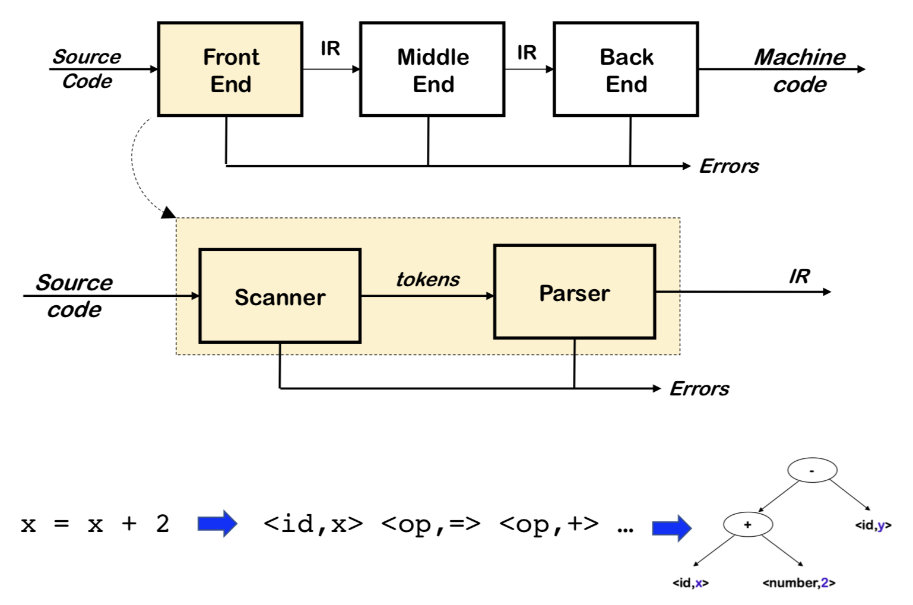
    The responsibility of scanner is map character/byte stream into tokens. What is token? Token is something like `<id, x>`, for example, I have a cpp code looks like
    ```cpp
    x = x + 2;
    ```
    In scanner stage, it will be translate into
    ```token
    <id, x> <op, => <id, x> <op, +> <number, 2>
    ```
    Now we have a problem, how do we specify the **legal** tokens? The first step is to recognize if the identifier is legal or not
    * Regular expression, only words derived from regex are acceptable
    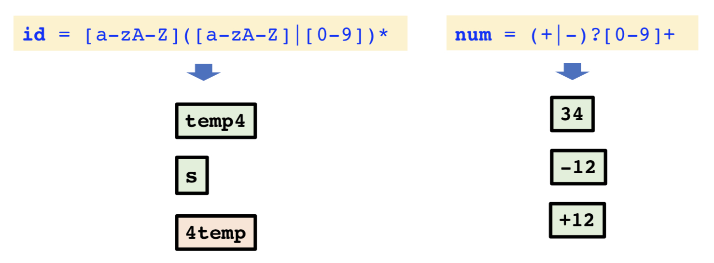
    Then we need to judge the whole expression is legal or not
    * Deterministic Finite Automaton(DFA)
    * Longest match principle
    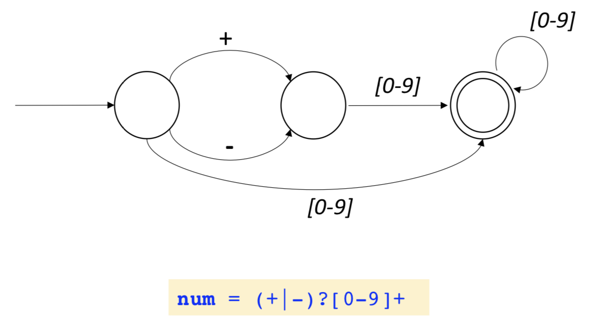
    
    Then we need to send those tokens to **Parser** to generate a parse tree, to do that, we can use **Contex-Free Grammer(CFG)**. In Compiler, we often use **Abstract Syntax Tree(AST)**. In AST, we will put identifier and number in leaf node, and operation in non-leaf node. Just like this
    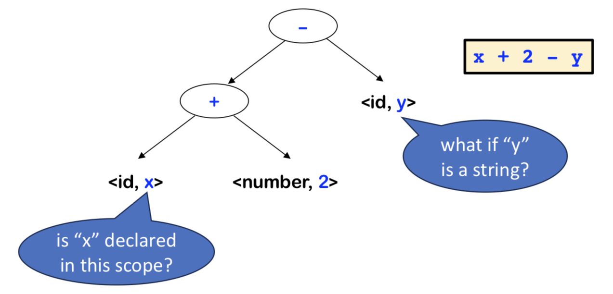
    Also, during the process of builing AST, the compiler will also check if the usage of number and identifier is legal or not.

2. Middle End
    Middle End stage is an optimizer, the main responsibilities of it are:
    * Analyzes IR and rewrites(ro transforms) IR
    * Primary goal: refuce running time of the compiled code
    * Other goals: improve space, energy consumption
    * Must preserve the **meaning** of the code

    But what kind of optimization will middle end use? One of it is subscript, for example, assuming that we have a C code below
    * Subscript
        ```c
        for(int j = 0; i < n; j++) {
            A[i][j] += C;
        }
        ```
        In memory, 2 dimensional array is stored just like 1 dimensional array, we need to calculate the offset of the element so that we can access the element.
        So actually we will have this kind of calculation in each loop:
        ```c
        for(int j = 0; i < n; j++) {
            addr(A(i, j)) = addr(A(0, 0)) + i * (row size) + j
            A[i][j] += C;
        }
        ```
        But in this expression, some calculation will not be changed during this loop
        ```c
        addr(A(0, 0)) + i * (row size) // this part will always be the same throughout the whole loop
        ```
        So, we can 


3. Back End
    The overview of Back End stage:
    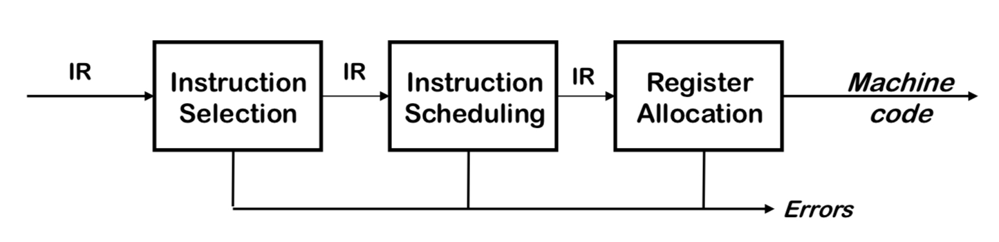
    The responsibilites of Back End stage:
    * Translate IR into target machine code
    * Choose instructions to implement each IR operation
    * Find a good order for the instructions to execute
    * Decide which value to keep in register

### Overview of IR
In compiler, it may adopt multiple IRs. If we try to categorize it with Levels, we will have 2 different kinds of IRs. 
* One is **High-level IR(HIR)**, which is closer to source code
* The other is **Low-level IR(LIR)**, which is closer to machine code/assembly instructions.
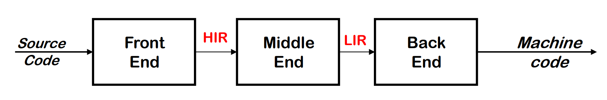

#### Types of IR
If we categorize it in its structure, we will have 3 different types of IRs
* **Structural/Graphical IRs**: expressed as a tree/graphs with nodes and edges
* **Linear IRs**: a linear sequence of operations
* **Hybird IRs**: combine elements of both graphical and linear IRs.

1. Structural IR:
    * **Parse Tree**: Term and operator will always in leaf node and the non-leaf node will be expression node. For an expression `x + 2 - y`, the parse tree will be:
    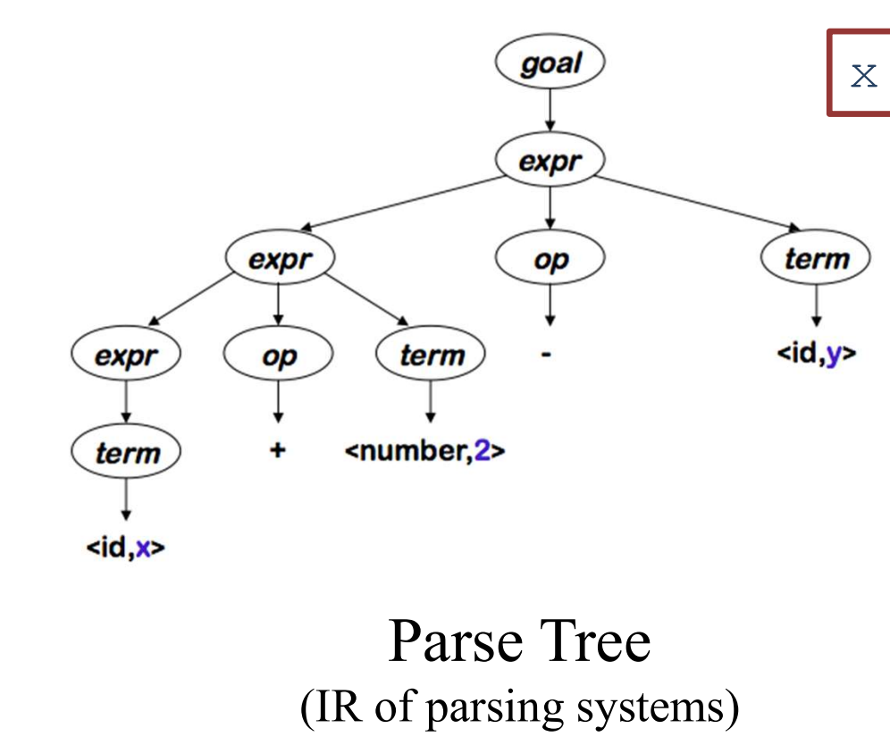

    * **Abstract Syntax Tree(AST)**: Term will always be represented in leaf node and operator will be represented in non-leaf node. For an expression `x + 2 - y`, the AST will be:
    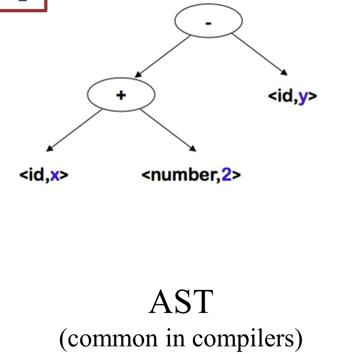

    * **Directed Acyclic Graph(DAG)**: It removed redundency(common subexpression) in AST. For example, assuming we have a single line expression `a * 2 + a * 2 * b`, its DAG will be:
    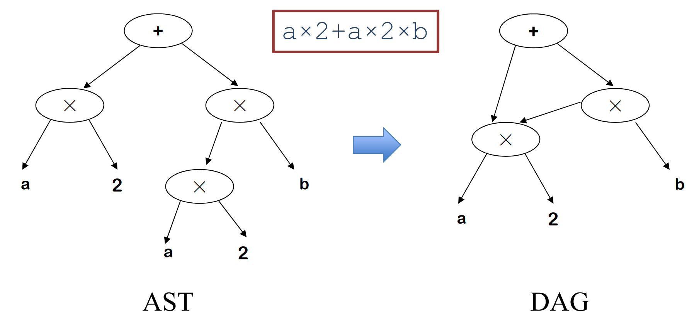
        And also, DAG can represent a linear sequence of operations, for example:
        ```c
        int a = b * c;
        int d = a + b;
        int e = a + d;
        ```
        Its DAG will be:
        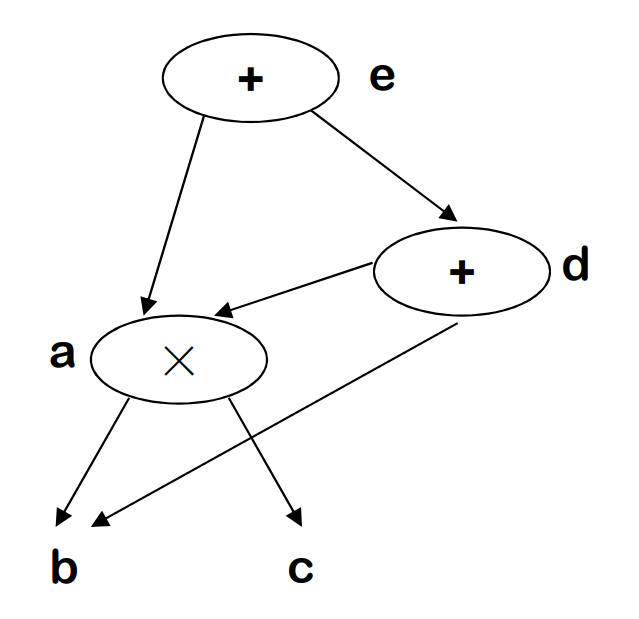

    * **Cell Graph**: It represent functions calling relations. It is the basis for inter-procedural analysis

    * **Dependence Graph**

2. Linear IR
    Linear IR will represent IR as a list of operations, it looks like some kind of low-level code for some "imaginary machine" and assembly.
    However, in Linear IR, we need some special instructions for representing branch. For example, if we have an `if-else` code like this:
    ```c
    // if this branch is true, we need to jump over after finishing the if part
    // if it's false, we need to directly jump to else segment
    if(p > 60) {    
        p = 0;
        i = 5;
    } else {
        t = i * 2;
        i = t + 1;
    }
    ```
    So, the linear IR will looks like:
    ```assembly
        r = CMP_GT p, 60
        cbr r, L1, L2
    L1  p = 0
        i = 5
        br L3
    L2  t = i * 2
        i = t + 1
    L3  ...
    ```
    For loop, there are the example,
    ```c
    do {
        p = p + i;
    } while(p < 20); // if this branch is true, it will jump backward to *do* keyword
    ```
    The linear IR will looks like:
    ```assembly
    L1  p = p + i
        r = cmp_LT p, 20
        cbr r, L1, L2
    L2  ...
    ```

    There are different types of Linear IRs:
    * **Three-address Code**
        Forms: `z <- x op y` or `op x, y, z`(one operator and three identifier)
        For example: `z = x - 2 * y;` becomes
        ```assembly
        t <- 2 * y
        z <- x - t
        ```
        **The advantages of Three-address Code:**
        1. Resembles many machine instructions.
        2. Reasonably compact.
    * **Stack Machine Code**
        Forms: one or no address `op x` or `op`
        For example: `z = x - 2 * y;` becomes
        ```assembly
        push        2
        push        y
        multiply
        push        x
        subtract
        ```
        **The advatages of Stack Macine Code:**
        1. Even more compact
        2. Simple to generate and execute


3. Hybird IR: **Control-flow Graph(CFG)**
    Generally speaking, hybird IR is looks like structral IR, but each node is a **basic block** instead of an operator or an identifier.
    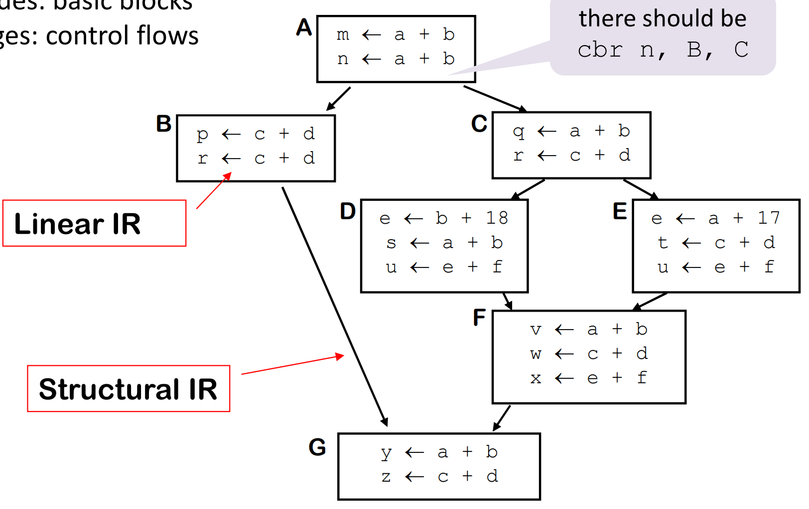
    So what is a **basic block**?
    Basic block is a maximal straight-line sequence of operations with no branches in(except the entry) or out(except the exit) - either all instructions are executed or none are executed.
    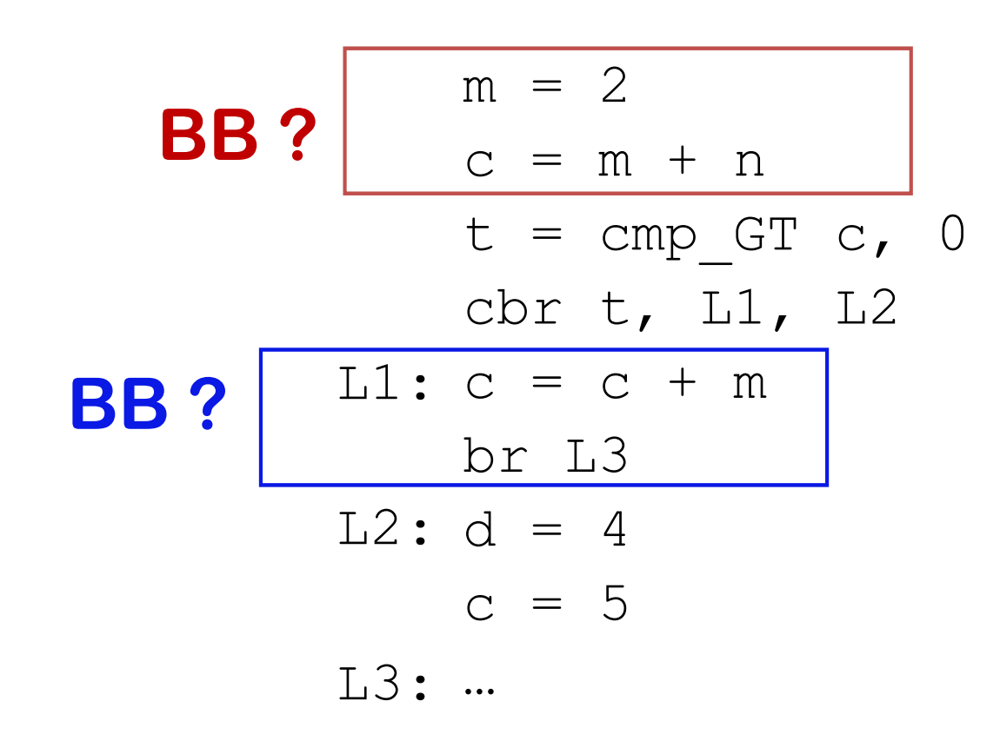
    For example, in the image above, the red block is not a BB, but the blue one is.

#### Linear IR to CFG
**Two-Pass Solution**: 
1. The first pass is to find leaders and create nodes(A leader refers to the first operation of a block)
    * The very initial operation
    * Operations with labels(targets of branches)
2. Find last operations and add edges
    * Iterate over the leaders to find ends.(before another leader)
    * Add edges
        * If the block ends with a branch/jump, add an edge to the corresponding target blocks.
        * Otherwise, add an edge to the block of next leader

#### AST to Linear IR
**Post-order Tree Walk**:
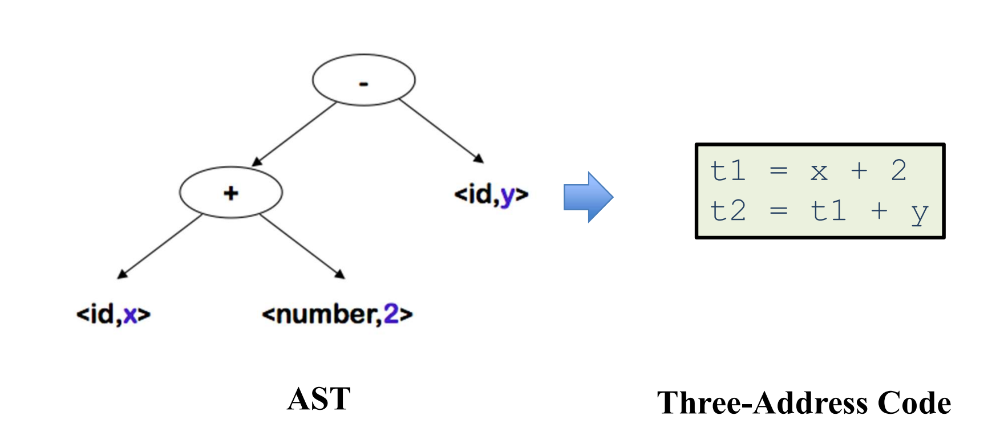