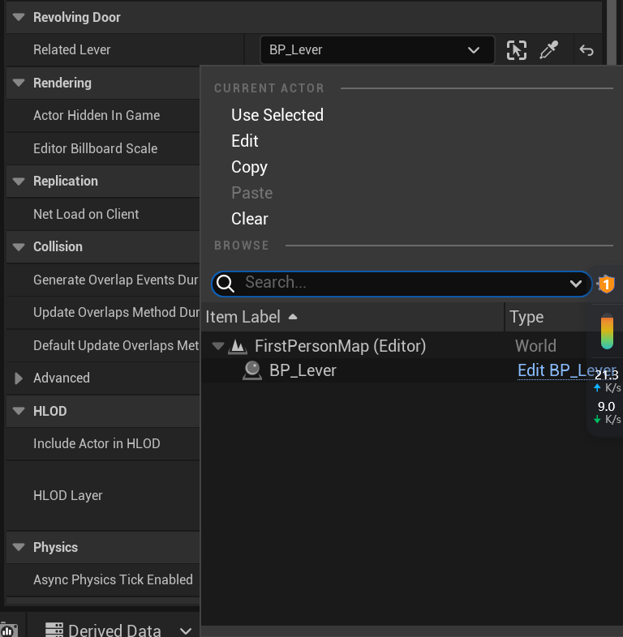

## 每日记录

### 7.11
开始头两周的项目实习，题目是：
开发一个环境交互系统，使玩家能够与场景中的物体进行交互（如开门、拾取物品、触发机关等）。 
内容:
1. 创建交互物体的蓝图或C++类。
2. 实现玩家与物体的交互逻辑。
3. 添加不同类型的交互物体，如门、按钮、拾取物品等。
4. 添加测试场景，可测试可交互物体的表现

在刚刚得到任务的今天，完成了基础框架的搭建，包括：
1. 物品`UItem`类型的定义，其中的数据包括物品的Icon、名字、数量、最大数量、是否能堆叠等信息，同时还完成了`ItemActorBase`的定义，这个类是用来表示物品在世界中的形式的。
2. 通过在Character中的Tick函数进行对于Interactable类型LineTrace检测当前摄像机前方的物品，并获取物品信息显示在HUD中
    在这个过程中发现一个问题，由于检测到的物品只有在发生改变的时候才会通知UI进行更新，这使得比如说在ALever中，鼠标不移动开的情况下，将拉杆从关的状态转变为开的状态，但是显示的互动提示仍然是关闭拉杆，并没有更新。
    对于这个问题，我目前有两个想法：
    * 将HUD的更新转变为每一个Tick都检测一次(但是这种方法非常消耗资源，Tick是能不用就不用的)
    * 在ALever自身发生状态改变的时候，手动的通知UI进行一次更新(从性能方面来讲这种更好，但是会增加类与类之间的耦合)

3. 定义了IInteractable接口，这个接口包括三个函数，分别是：
    ```cpp
    UFUNCTION(BlueprintCallable, BlueprintNativeEvent, Category = "Interact")
	bool CanInteract(UItem* InHandItem) const;							// 获取当前的Actor是否能互动
	virtual bool CanInteract_Implementation(UItem* InHandItem) const;

	UFUNCTION(BlueprintCallable, BlueprintNativeEvent, Category = "Interact")
	void Interact(UItem* InHandItem, AActor* FromActor);				// 与Actor互动
	virtual void Interact_Implementation(UItem* InHandItem, AActor* FromActor);

	UFUNCTION(BlueprintCallable, BlueprintNativeEvent, Category = "Interact")
	FString GetInteractText();											// 获取当前Actor的互动数据
	virtual FString GetInteractText_Implementation();
    ```
4. 完成了`ALever`类型的创建，这个Actor是一个拉杆Actor，实现了IInteractable接口，每当玩家进行互动的时候就会变换状态，并且在其中定义了一个动态多播，用来绑定与其相关联的其他Actor的状态。比如说操控一扇门
    ```cpp
    DECLARE_DYNAMIC_MULTICAST_DELEGATE_OneParam(FOnLeverStatusChanged, bool, IsOn);
    ```
    同时，这个拉杆的实际外在表现是通过`PhysicsConstraintComponent`来控制Lever的AngularTargetOrientation参数来实现的动画效果，比起单纯的进行插值播放动画，这种方式实现的动画更具有动感和更符合现实物体效果

5. 完成了`ARevolvingDoor`(旋转门)的创建，并将其与开关的状态绑定起来，当绑定的开关的状态是开的时候，就会修改其中的PhysicsConstraint的AngularTargetVelocity来为其添加一个恒定的角速度。
    要实现绑定关卡中Lever的效果，可以在CPP中的成员变量中增加如下的一个成员变量，需要注意的是，这个成员变量需要设置为`EditInstanceOnly`或者`EditAnywhere`，并且这个参数只有在LeverEditor中才能进行选择，而在默认的蓝图界面中则是无法选择想要的对应Actor的。
    ```cpp
    UPROPERTY(BlueprintReadOnly, EditInstanceOnly)
	ALever* RelatedLever;		// 用来绑定状态的Lever
    ```
    


明日计划：
1. 完成能直接互动的门的创建 **Done**
2. 完成基础背包的创建 **Done**
3. 完成拾取物品逻辑的创建 **Done**
4. 解决同一可交互物体在状态改变后不更新Notice的问题 **Done**


### 7.12
今天完成了昨日定下来的计划，实现了一个建议的背包和门，并且解决了昨日发现的问题。

对于测试场景，根据GPT的建议，是设计一个简单的解密关卡。总共分为四个场景：
1. 入口区域：
    在这个区域中，玩家通过捡拾钥匙获得打开后续关卡的钥匙。
2. 雕像谜题房间：
    在这个区域中，玩家会在进门后获取到一张图片，用来表示雕像的正确朝向，玩家需要将图片中对应的雕像转向指定的方向后，下一个房间的大门开启。
3. 图书馆房间：
    书架可以移动，整体玩法类似于推箱子，其中一个区域可以找到一本书，在获得这本书之后会发现一个密道（也就是解锁一个可活动的书架），在其中能找到打开宝藏房间中额外奖励的钥匙。
4. 宝藏房间：
    两个宝箱，一个不需要钥匙，能直接打开；另外一个是需要在图书馆房间的秘道中获取钥匙后才能打开。

7.15计划：
1. 完成背包系统简单的UI，包括拾取后显示，拖拽丢弃
2. 开始编辑测试场景