# MySQL 基础知识

## SQL的分类
* **DDL(Data Definition Language)**: ``CREATE`` | ``ALTER`` | ``DROP`` | ``RENAME`` | ``TRUNCATE``
* **DML(Data Manipulation Language)**: ``INSERT`` | ``DELETE`` | ``UPDATE`` | ``SELECT``
* **DCL(Data Control Language)**: ``COMMIT`` | ``ROLLBACK`` | ``SAVEPOINT`` | ``GRANT`` | ``REVOKE``

### DDL的使用
DDL的操作一旦执行，就不可回滚
1. ``CREATE``: 创建数据库，表等信息
    ```sql
    CREATE DATABASE database_name # 创建数据库
    CREATE TABLE table_name(field1 field1type, field2 field2type, ...) # 创建数据表
    ```
2. ``ALTER``:
3. ``DROP``:
4. ``RENAME``:
5. ``TRUNCATE``: 删除指定表中的所有数据，保留表结构，数据不可以使用``ROLLBACK``回滚
    ```sql
    TURNCATE TABLE table_name;
    ```


### DML的使用
DML在默认情况下，一旦执行，也是不能回滚的，想要实现回滚功能，需要在执行DML前执行
```sql
SET autocommit = FALSE;
```
1. **DELETE**: 删除指定表中的数据，就算清空所有数据，也能保留表结构，可以回滚
    ```sql
    DELETE FROM table_name (WHERE condition);
    ```

### DCL的使用
1. **COMMIT**: 提交数据，一旦执行``COMMIT``，则数据就被永久保存在数据库中了，意味着不可以被回滚
2. **ROLLBACK**: 回滚数据，一旦执行``ROLLBACK``，则可以实现数据的回滚

## MySQL 数据类型

## MySQL 高级特性

### MySQL的配置
#### 1. 默认字符集
在MySQL8.0中，默认字符集是utf8mb4，意味着数据库中能直接存储中文等复杂字符信息。而在MySQL5.7中，默认字符集是latin1，这个字符集不包含中文，假如我们尝试插入中文信息，在MySQL5.7中会出现错误。
为了解决MySQL5.7默认不支持中文的问题，第一个方法，我们可以在后端将中文信息使用**Base64编码**将信息转换为只用latin1中的字符就可以表示的形式再存入数据库。
第二个方法，我们可以修改默认字符集
```sh
vim /etc/my.conf #进入mysql在linux中的配置文件
```
在文件的最后加上
```sh
character_set_server=utf8 #配置字符集
```
最后重启MySQL服务
如果要修改现有的数据表的字符集，可以使用以下指令
```sql
ALTER TABLE table_name CONVERT TO CHARACTER SET 'utf8'; # 修改现有数据表的字符集
```

#### 2. 各个级别的字符集
在MySQL上有4个级别的字符集和比较规则，分别是：
* 服务器级别(*_server): 一个mysql服务器会有一个默认的字符集设置，可通过上面提到的方法进行修改
* 数据库级别(*_database): 每一个database都可以设置自己的字符集，当创建数据库时没有指定字符集，这个数据库的字符集会跟随服务器级别的字符集
* 表级别: 每一张数据表都可以有自己的字符集，当我们在创建表的时候没有指定字符集，这个表的字符集就会跟随数据库级别的字符集
* 列级别: 我们可以为数据的每一列都单独设置一个字符集，当我们在创建列的时候没有指定字符集，这个列的字符集会跟随表级别的字符集

查看所有级别的字符集，我们可以通过以下的sql命令实现
```sql
SHOW VARIABLES LIKE 'character%'
```
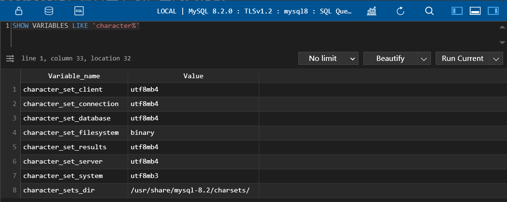

#### 3. 请求到响应过程中字符集的变化
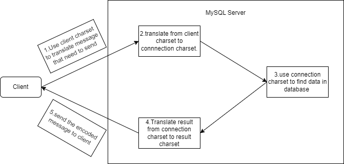
需要注意的是，发送请求的客户端的字符集需要和MySQL Server的``character_set_client``保持一致，而接受响应的客户端的字符集需要和MySQL Server中的``character_set_results``保持一致，否则会出现乱码。

#### 4. SQL的大小写规范
在SQL中，分为case sensitive和case insensitive两种，第一种表示大小写会影响到实际的查询，而第二种则相反，举个例子，假设我们有个数据库名字叫dbtest，在case sensitive的情况下：
```sql
USE dbtest; # 正常访问dbtest database
USE dBtest; # 报错，无法访问
```
而在case insensitive的情况下：
```sql
USE dbtest; # 正常访问dbtest database
USE dBtest; # 同样能访问dbtest database
```
默认情况下，`Windows系统是case insensitive`，而`Linux系统下是case sensitive`，通过使用以下SQL我们可以查看这一参数：
```sql
SHOW VARIABLES LIKE '%lower_case_table_names%'; # 检查当前SQL是否大小写敏感
```
`此参数默认为0，表示大小写敏感`，当参数为1时，表示大小写不敏感

#### 5. sql_mode 设置
查看当前的sql_mode:
```sql
SELECT @@session.sql_mode;  # 查看当前MySQL的sql_mode
```
**宽松模式**: 在这个模式下，即使我们在插入数据的时候给了一个错误的数据，也可能会被接受，比如我有一个表：
```sql
CREATE TABLE users(username, char(10));
```
我们可以看到，username这个field的长度应该是10，但是在宽松模式下，如果我们插入例如`0123456789abcd`，已经超过了10这个长度，SQL并不会报错，而是会截取前10个字符存入数据库中。
```sql
INSERT INTO users (username) VALUES ('0123456789abcd'); # 不会报错
```
**严格模式**: 对于上面这种情况，在严格模式下则是会报错
```sql
INSERT INTO users (username) VALUES ('0123456789abcd'); # 会报错
```

#### 6. MySQL的数据目录（数据都是存档在Linux的哪个目录下？）
##### 6.1 MySQL数据库的存放路径
`/var/lib/mysql/`: 这个目录下存放的是通过`CREATE DATABASE database_name`创建的数据库(database)文件夹
实际上，这个文件夹的路径可以通过SQL语句查询查看：
```sql
SHOW VARIABLES LIKE 'datadir'; # 查看数据库文件路径
```
`/usr/bin/`和`/usr/sbin/`: 这个目录下存放的是所有Linux的可执行指令，包括MySQL的指令的可执行文件
`/usr/share/mysql-8.0/`: 这个目录下存放的是MySQL命令及配置文件
`/etc/`: 用来存放`my.cnf`配置文件
##### 6.2 MySQL系统自带的数据库
* `mysql`
    MySQL系统自带的核心数据库，存储了MySQL的**用户账户和权限信息，一些存储过程、事件的定义信息，一些运行过程中产生的日志文件，一些帮助信息以及时区信息等**
* `information_schema`
    MySQL系统自带的数据库，保存着MySQL服务器**维护的所有其他数据库的信息**，比如有哪些表，哪些视图，哪些触发器，哪些列，哪些索引。在这个数据库中还包括一些以`innodb_sys`开头的表，用于表示内部系统表
* `performance_schema`
    MySQL系统自带的数据库，保存着MySQL服务器运行过程中的一些状态信息，可以用来**监控MySQL服务的各类性能指标**。包括统计最近执行了哪些与具有，在执行过过程中的每一个阶段都花费了多长时间，内存的使用情况等
* `sys`
    MySQL系统自带的数据库，这个数据库主要是通过**视图**的形式把`information_schema`和`performance_schema`结合起来，帮助系统管理员和开发人员监控MySQL的技术性能

##### 6.3 数据库在文件系统中的表示（Innodb）
正如我上面所述，所有的数据库文件夹是存放在`/var/lib/mysql/`这个路径下的，我们可以在这文件加下找到诸如`mysql`，`sys`，`performance_schema`等文件夹，也包括我们自己创建的database文件夹。
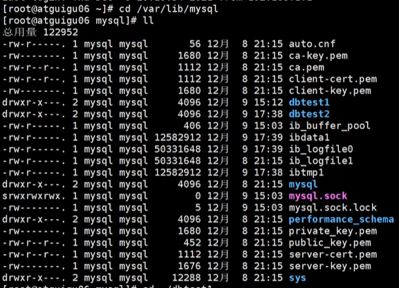
我们可以进入数据库文件夹，在MySQL5.7版本下，我们会发现每一个数据表对应着两个文件，`table_name.frm`和`table_name.ibd`，其中frm文件是负责存放表结构的，而ibd则是负责存放对应的数据，以及一个额外的`db.opt`文件，这个文件负责存放该数据表的一些默认设置，如字符集设置、比较规则等。
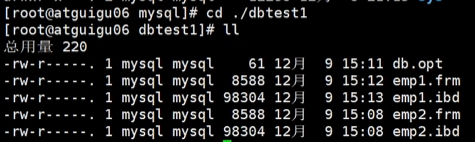
而在MySQL8.0版本下，我们会发现一个数据表只对应了一个`table_name.ibd`文件，同时也没有了`db.opt`，实际上是所有的5.7版本多出来的文件所存储的信息都整合到了.ibd文件当中

##### 6.4 数据库在文件系统中的表示（MYISAM）
和Innodb引擎一样，数据库文件夹也是存放在`/var/lib/mysql/`这个路径下的，和Innobd相比，在MySQL5.7版本下，除了.frm文件外，另外的两个文件是`table_name.MYD`和`table_name.MYI`，实际上这两个文件存储的信息就等于在Innodb中的.ibd文件
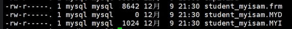
而在MySQL8.0版本下，数据表依旧是分开存储的，.MYD和.MYI保持不变，而.frm文件则变为了.sdi

#### 7. Mysql的配置文件

配置文件格式
在MySQL的配置文件中，启动选项被划分为若干组，每一个组有一个组名，用中括号`[]`括起来，如下所示
```properties
[server]
# some properties

[mysqld]
# some properties

[mysqld_safe]
# some properties

[client]
# some properties

[mysql]
# some properties

[mysqladmin]
# some properties
```
每一个propertiy有两种格式，分别是
```properties
[server]
option1             # only key
option2=value2      # key-value format
```
#### 8.MySQL的用户与角色管理

### MySQL 架构

#### 1. Mysql的整体架构
MySQL是典型的CS架构，客户端向服务器进程发送一段文本（SQL语句），服务器处理后再向客户端发送一段文本（处理结果），我们以查询请求为例，具体流程如下图所示：
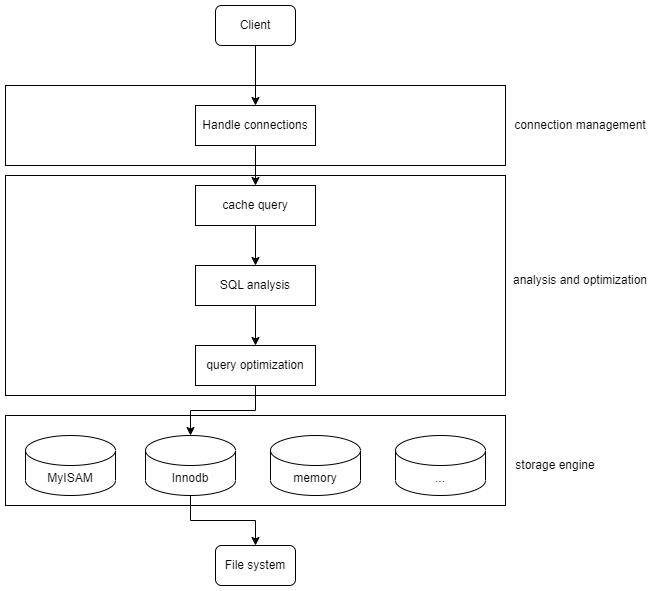
下面这张图能很好的展示展开后的MySQL5.7的架构

* `Connectors`: 表示MySQL服务器以外的客户端程序（与各个语言相关，图JDBC是Java用来链接服务器的库）
* `Services & Utilities`: 基础服务组件
* `Connection Pool`: 提供了多个用于客户端与服务器端进行交互的线程
* `SQL Interface`: 接受SQL指令并且返回查询结果的
* `Parser`: 用于解析SQL Interface传过来的SQL指令，包括：语法解析、语义解析，最终生成语法树
* `Optimizer`: **核心组件**，对SQL进行优化，并生成一个`执行计划`
* `Cache`: 以Key-Value的形式缓存查询结果 **MySQL8.0已废除**
* `Pluggable Storage Engines`: 与操作系统的文件系统进行交互，真正在文件系统中进行数据读取的实际上是Storage Engines
* `File System`: 操作系统提供的文件系统

整体上，MySQL分为**连接层**，**服务层**和**引擎层**，连接层包括Connection Pool，服务层包括SQL Interface、Parser、Optimizer和Cache，引擎层指的是Pluggable Storage Engines。

#### 2. SQL的执行流程

一个SQL语句的大致的执行顺序是怎么样的呢？
`1.在客户端使用如JDBC等库发送SQL语句到MySQL服务器中` -> `2.在Connection Pool中创建线程，建立连接` -> `3.调用相关的SQL Interface` -> `4.在Cache中查询是否有已经存在的一摸一样的查询结果（deprecated in Mysql8.0）` -> `5.Parser解析SQL语句，生成语法树` -> `6.在Optimizer对SQL进行优化（逻辑上与物理上（使用索引））` -> `7.调用Storage Engine的API进行查找` -> `8.在文件系统进行查找` -> `9.将查询结果缓存在Cache中（deprecated in Mysql8.0）` -> `10.将数据返回到客户端`

在MySQL Server中，大致分为以下几步: 
1. 查询缓存: Server如果在查询缓存(Cache)中发现了这条sql语句，就会直接将结果返回给客户端。如果没有，则进入解析器阶段。**由于缓存命中率太低，在MySQL8.0中已经被废弃**
2. 解析器: 在解析其中对SQL语句进行语法分析，语义分析(编译原理)
3. 优化器: 在优化其中会确定SQL要做什么，比如是根据`全表检索`还是`索引检索`等，并生成一个执行计划。为什么要有优化器？因为一条查询可以有很多种执行方式，最后都返回相同的结果。**优化器的作用就是找到这其中最好的执行计划**
在优化器中，可以分为**逻辑查询**和**物理查询**优化阶段。
**详细请看 MySQL索引以及调优篇**
    * 逻辑查询就是通过改变SQL语句的内容使得查询更加高效，同时为物理查询优化提供更多的候选执行计划。通常采用的方式是对SQL语句进行`等价变化`，对查询进行`重写`，对查询重写的数学基础是关系代数。对条件表达式进行等价谓词重写，条件简化，对视图进行重写，对子查询进行优化，对连接语义进行了外连接消除、嵌套链接消除等。
    * 物理查询优化是基于关系代数进行的查询重写，而关系代数每一步都对应着物理计算，这些物理计算往往存在这多种算法，因此需要计算各种物理路径的代价，从中选择代价最小的作为执行计划。在这个阶段里，对于单表和多表连接的操作，需要高效的`使用索引`，提升查询效率。
4. 执行器: 当优化器产生一个执行计划后，就会将执行计划交到执行器中。在执行计划前需要去判断用户是否`具有执行权限`，也就意味着**执行权限的检查是发生在执行器阶段的**。在MySQL8.0以下版本，如果设置了查询缓存，就会在这个阶段将查询结果进行缓存。
如果用户有执行权限，则执行器会开始调用存储引擎(Pluggable Storage Engine)的API进行数据的查询。

在MySQL中如何实际的查看一个SQL语句的执行过程呢？首先，我们需要将MySQL的profiling的值设置为1（默认值为0）
```sql
SET profiling=1;
```
设置完成后我们使用如下SQL语句进行查询，查看是否修改成功
```sql
SELECT @@profiling;
```
若结果如下图所示，则表示修改成功
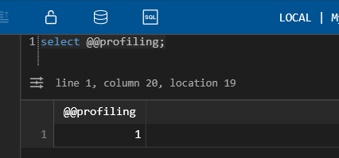
随后我们随便执行一些SQL语句，比如：
```sql
select * from users;
```
随后，我们可以使用以下的SQL来查询我们的SQL语句执行记录
```sql
SHOW profiles;  # 查看执行过的SQL
```
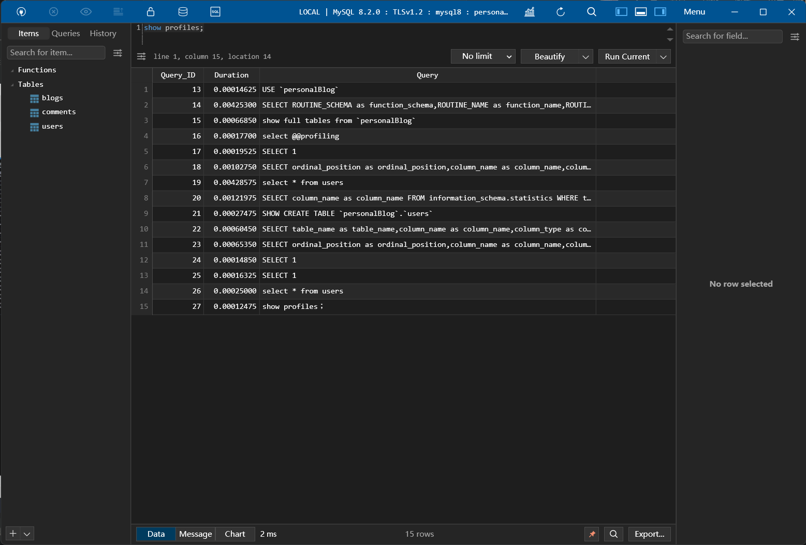
如果我们想查看具体某一个SQL语句的细节呢？如下的两条SQL语句能实现这一个功能：
```sql
SHOW profile;                       # 查询最后一句SQL的执行过程
SHOW profile for query query_id;    # 查询具体某一句SQL的执行过程
```
](MySQL_images/show_profile.png)

#### 3. 存储引擎
存储引擎负责控制数据表的存储格式并且提供一系列的API完成帮助MySQL服务层获取相关数据。简而言之，存储引擎就是表的类型，也可以称为表管理器。

1. InnoDB引擎: 具备**外键功能**的**事务**存储引擎
    * InnoDB是MySQL的默认事务引擎，被设计用来处理大量短期事务。可以确保事务的完整提交(Commit)和回滚(Rollback)。
    * **除非有特别原因需要使用其他存储引擎，否则应该优先考虑InnoDB!**
    * 对于单条数据的写性能较差
    * InnoDB的缓存需要存储索引以及真实数据，对内存的要求比较高

2. MyISAM引擎:
    * 不支持**事务**、**行级锁**、**外键**，且由于不支持事务，**崩溃后无法安全恢复**
    * 访问的速度比InnoDB**快**
    * 对数据统计有额外的常数存储。故而使用`COUNT(*)`速度很快

3. 对比

    | 对比项 | MyISAM | InnoDB |
    | ------- | ------- | ------- |
    | 外键 | 不支持 | 支持 |
    | 事务 | 不支持 | 支持 |
    | 行表锁 | **表锁**，即使操作一条数据也会锁住整个表，**不适合高并发** | **行锁**，操作时只锁一行，不对其他行有影响 |
    | 缓存 | 只缓存索引，不缓存真实数据 | 不仅缓存索引还要缓存真实数据，对内存要求要求较高，而且内存大小对性能有决定性的影响 |
    | 自带系统表使用 | Yes | No |
    | 关注点 | 性能：节省资源、消耗少、简单业务 | 事务：并发写、事务、更大资源 |
    | 默认安装 | Yes | Yes |
    | 默认使用 | No | Yes |

4. Archive引擎: 用于数据存档
    * 这个引擎仅支持数据的插入和查询，行被插入后不能再被修改
    * 插入的效率很高，但查询的效率较差
    * 存入的数据会被压缩存储，与MyISAM相比占用空间大约小**75%**，与InnoDB相比大约小**83%**
    * 采用行级锁，支持`AUTO_INCREMENT`列属性
    * 适合用作**日志和数据采集（归档）**类应用，适合存储**大量的独立的作为历史记录的数据
    * 下面是Archive存储引擎的功能：

        | 特征 | 支持 |
        | ---- | ---- |
        | B树索引 | 不支持 |
        | 备份/时间点回复（在服务器中实现，不是在存储引擎） | 支持 |
        | 集群数据库支持 | 不支持 |
        | 聚集索引 | 不支持 |
        | 压缩数据 | 支持 |
        | 数据缓存 | 不支持 |
        | 加密数据（加密功能在服务器中实现） | 支持 |
        | 外键支持 | 不支持 |
        | 全文检索索引 | 不支持 |
        | 地理空间数据类型支持 | 支持 |
        | 地理空间索引支持 | 不支持 |
        | 哈希索引 | 不支持 |
        | 索引缓存 | 不支持 |
        | 锁粒度 | 行锁 |
        | MVCC | 不支持 |
        | 存储限制 | 没有任何限制 |
        | 事务 | 不支持 |
        | 更新数据字典的统计信息 | 支持 |

5. Blackhole引擎: 丢弃写操作，读操作会返回空内容
    * Blackhole引擎没有实现任何存储机制，会**丢弃所有插入的数据**，不做任何保存
    * 但服务器会记录Blackhole表的日志，所以可以用于复制数据到备库，或者简单的记录到日志。**不推荐**

6. CSV引擎: 存储数据时，以逗号分割各个数据项
    * 可以将普通的CSV文件作为MySQL的表来处理，但不支持索引
    * CSV可以作为一种数据交换的机制，非常有用
    * CSV存储的数据可以直接在操作系统里，用文本编辑器或者Excel读取
    * 对于数据的快速导入导出是有明显优势的

7. Memory引擎: 置于内存的表
    * 将数据存储在内存中，速度快，但系统崩溃时会丢失数据（内存的特点）
    * Memory引擎同时支持**哈希索引**和**B+树索引**
    * Memory表至少要比MyISAM表快一个数量级（DRAM和硬盘的对比）
    * Memory表的大小是受限制的，主要取决于`max_rows`和`max_heap_table_size`这两个参数的限制
    * Memory表的表结构存在于硬盘中，但数据存在于内存中

### MySQL 索引及调优
#### 索引的数据结构
1. 为什么使用索引
    索引是存储引擎用于快速查找到数据记录的一种数据结构，如同一本书的目录一样，通过目录我本就能快速找到需要的内容而不需要一页一页翻看确认。在MySQL中也一样，进行数据查找时，首先**查看查询条件是否命中某条索引**，符合这通过索引查找，如果**不符合则需要全盘扫描**，即一条一条记录地查找。
    通过建立索引，我们能极大的减少磁盘的IO次数，加快查询效率。

2. 索引的概念
    在MySQL中索引的定义为: **索引（index）是帮助MySQL高效获取数据的数据结构**
    索引本身是数据结构，可以简单理解为`排好序的快速查找数据结构`，满足特定的查找算法。
    **索引是在存储引擎中实现的**，因此每种存储引擎的索引不一定完全相同，并且每种存储引擎不一定支持所有索引类型。同时，存储引擎可以定义每个表的`最大索引数`和`最大索引长度`。每个存储引擎支持每个表**至少16个索引**，总索引长度**至少为256字节**。

3. 索引的优点
    * **降低数据库的磁盘I/O成本**
    * 通过创建索引，可以保证数据库表中的每一行**数据的唯一性**
    * 可以提高有依赖关系的子表和父表的联合查询，加速**表和表之间的连接**
    * 在使用分组和排序进行数据查询时，可以显著**减少查询中分组和排序的时间**，降低CPU的消耗

4. 索引缺点
    * **创建和维护索引需要耗费时间**，并且随着数据量的增加，所耗费的时间也会增加
    * **索引需要占用磁盘空间**，如果有大量索引，索引文件可能就比数据文件更快到达最大文件尺寸
    * 虽然提高了查询速度，同时却会**降低更新表的速度**。因为当对表中的数据进行增加、删除和修改时，索引也要动态地维护

5. 索引的简单设计思路
    在MySQL中，数据表实际上是分页存储的，在磁盘上的地址并不连续。每一个**数据页的大小为16KB**。
    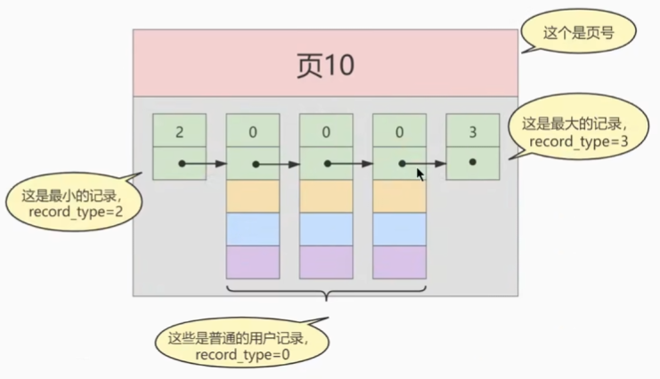
    设想一种情况，假设我们有一个数据表的定义如下:
    ```sql
    CREATE TABLE users(userId BIGINT AUTO_INCREMENT, userName varchar(255), PRIMARY KEY (userId)) ROW_FORMAT=Compact;
    ```
    假如我们的数据是乱序排序的，若是我们想通过某一个条件查找某一些数据，比如通过userName寻找用户名是qiweiwu的情况，我们只能顺序遍历，此时的时间复杂度为$O(n)$，且磁盘I/O次数等于数据页的数量。
    但是如果我们是通过userId查找的呢？由于userId是自增的，我们可以保证数据表中的数据存储是有序的，因此我们可以通过二分查找使我们的时间复杂度从$O(n)$降低为$O(logn)$。
    当然，实际的情况比这更复杂，由于磁盘的延迟比内存大很多，我们难以通过时间复杂度来评判一个算法究竟好不好，尤其是当数据表是通过多个并不连续的页存放的情况下，简单的使用二分查找会导致在不同的页表中不停跳跃，只是将磁盘的I/O次数从$n$次降低到$\log n$次。
    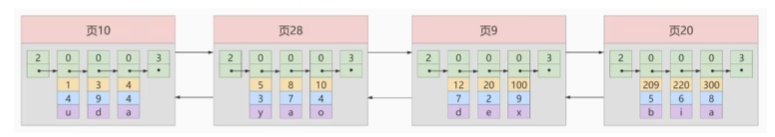
    那么有没有什么办法能只访问一次数据表就把我们想要招的数据找到呢？当然有！这就是索引最简单的设计。我们给每一个数据页都加上一个userId的索引，记录当前数据页的最小userId是多少，如下图所示
    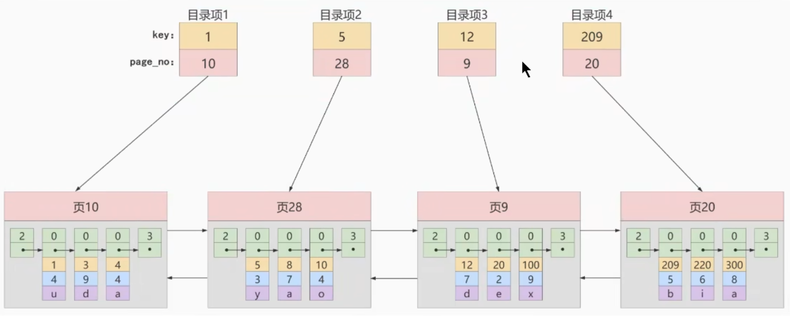
    这样，我们就能通过二分查找寻找到索引中的对应的数据页并访问了。在这种情况下，我们的磁盘I/O从$\log n$次降低为$2$次，一次从硬盘读取索引信息，一次读取数据表。

6. InnoDB的索引方案
    通过上面的讲解，似乎所有问题就解决了？当然不是！假如我们有很多的数据页的目录项呢？我们可以把所有的数据页目录都统一存放到一个数据表中，这个数据表中只存放对于某一个数据表的目录项。如图所示：
    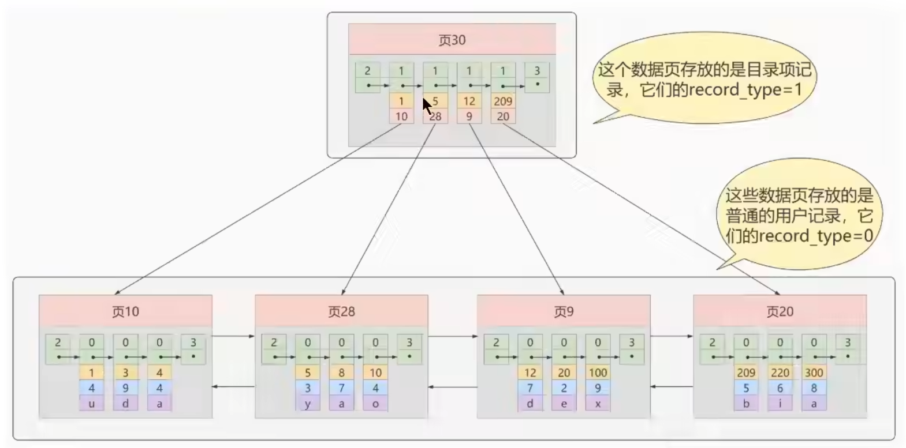
    实际上这就和我们在计算机操作系统中所学习的多级页表的概念是基本一样的。当我们的目录项数据页也变得多了起来的时候，我们同样需要再创建一层新的**目录的目录的数据页**

    最终，这一整个索引结构就变成了一棵树，这棵树就是B+ Tree
    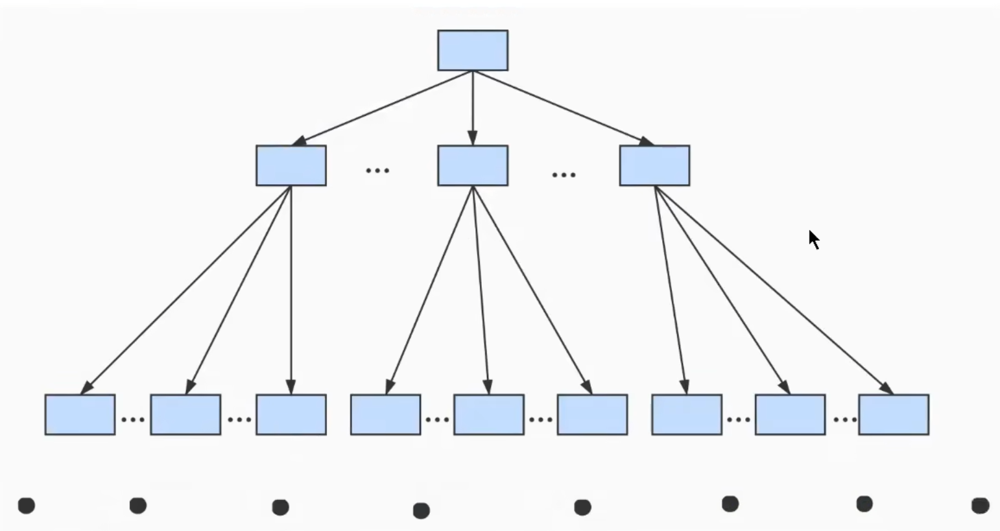
    这个树的叶子节点就是真正存储数据的数据页，而上面的节点都是用来存储索引信息的数据页。需要注意的是，MySQL的B+树的**所有叶子节点之间是通过双向链表连接**的，意味着跨数据页范围查找的情况下，不需要通过树的遍历方式查找下一个数据页，而是可以通过链表的访问方式进行访问。
    通常来说，这个B+树不会超过4层，意味着通过索引优化后，精确查询下磁盘的I/O次数不会超过4次！

#### 常见的索引概念
按照物理实现方式，索引可分为两种：**聚簇索引**和**非聚簇索引**。非聚簇索引又被成为二级索引或者辅助索引
1. 聚簇索引
    聚簇索引并不是一种单独的数据类型，而是一种**数据的存储方式**（所有的用户记录都存储在了叶子节点上）
    特点: 
    * 页内的记录是按照主键大小来进行排序的一个**单项链表**
    * 各个存放用户记录的页也是根据主键大小进行排序的**双向链表**
    * 处于同一层的目录页也是根据主键的大小进行排序的**双向链表**
    * B+Tree的叶子节点存储的是完整的用户记录，完整的用户记录指的是这个记录中存储了所有列的值，包括隐藏列
    
    优点: 
    * 数据访问更快，因为聚簇索引会把索引信息和数据信息存放到一棵树内
    * 聚簇索引对于主键的**排序查找**和**范围查找**速度非常快

    缺点:
    * **插入速度严重依赖于插入顺序**，如果插入的数据是按照索引是乱序的，则插入速度会很慢
    * 更新主键的代价很高，会导致被更新的行移动
    * B+Tree有多少层就需要多少次索引查找

    限制:
    * 由于数据物理存储排序方式只能有一种，所以每一个MySQL的表只能有一个聚簇索引，一般情况下就是这个表的主键。
    * 如果没有定义主键，Innodb会自动选择一个非空的唯一索引进行替代。如果没有，Innodb会隐式的定义一个主键来作为聚簇索引。

2. 非聚簇索引
    当我们想用非主键字段进行查找该怎么办呢，这时候就需要使用非聚簇索引了。 
    特点:
    * 目录页内的记录是按照某个特定的非主键字段进行排序的单项链表
    * 叶子节点不是用户数据页

**概念：回表**
根据非聚簇索引我们只能确定到我们要查找记录的主键的值，如果我们项根据非聚簇索引的列的值查找到完整的用户记录的话，仍然**需要到聚簇索引中根据获取的主键值再查一遍**，这个过程就被称为**回表**，也就是说根据非主键的值查询一条完整的用户数据**需要使用到2棵B+Tree**。

3. 联合索引
实际上联合索引就是非聚簇索引的一种，是一种同时为多个列建立索引的一种特别的非聚簇索引。假设我们想让B+Tree按照C2和C3两个列的大小进行排序，联合索引会：
    * 先把各个记录和页按照C2列进行排序
    * 在记录的C2值相同的情况下，采用C3列进行排序

#### InnoDB的B+Tree索引的注意事项
1. 根页面位置不会变化
在InnoDB中，实际上B+Tree的形成过程是这样的：
    * 每当为一个表创建一个B+Tree索引的时候，都会为这个索引创建一个根节点页面。最开始表中没有数据的时候，每一个B+Tree索引对应的根节点中既没有用户数据，也没有目录项记录
    * 随后向表中插入用户数据时，先把用户数据记录到这个根节点上
    * 当根节点中的可用空间用完时继续插入记录，此时会将根节点中的所有记录复制到一个新分配的页，比如`页A`中，然后对这个新页进行**页分裂**操作，得到一个新页，比如`页B`。此时新插入的记录根据键值的大小就会被分配到`页A`或者`页B`中，而根节点提升为目录页。
2. 内节点中目录项记录的唯一性
设想一个问题，如果我们的目录页中仅仅只存储了**索引列的值 + 下一页的指针**，如下图所示，我们可以看到，当我们向再次插入一条索引列值为1的数据的时候，我们就无法判断和决定这一条新数据应该存放在页4还是在页5中。
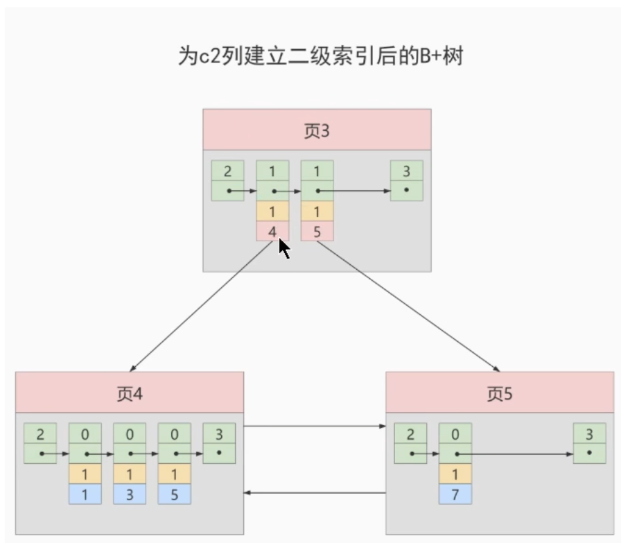
为了让新插入的记录能找到自己应该存放在哪一个页中，我们需要**保证B+Tree中同一层的节点内的项目记录除下一页的指针这个字段以外是唯一的。所以对于二级索引的内节点的目录项记录的内容实际上是由三个部分组成：
    * 索引列的值
    * 主键值
    * 下一页的指针

#### MyISAM中的索引方案
MyISAM存储引擎同样使用**B+Tree**作为索引结构，叶子节点的data field存放的是**数据记录的地址**。（因为在MyISAM中索引和数据是分开两个文件存放的）
由于是分开存放，所以在MyISAM中是没有聚簇索引的概念的。所有的索引都可以看作非聚簇索引。

#### 索引的代价
* 空间上的代价
    每建立一个索引都要为其建立一棵B+Tree，每一个B+Tree的每一个节点都是一个数据页，一个页会默认占用**16KB**的存储空间，一棵很大的B+Tree会由许多数据页组成，相当占用空间。
* 时间上的代价
    每次对表中的数据进行**增、删、改**操作的时候，都需要去修改各个B+Tree的索引。并且由于我们要维护树中数据的有序性，增删改操作可能会破坏节点的有序性，所以存储引擎就需要额外的时间进行一些**记录位移，页面分裂，页面回收等操作**，索引越多，额外付出的时间成本就更多。

#### MySQL数据结构选择的合理性
从MySQL的角度来说，选择数据结构的目标是为了让磁盘I/O的次数尽可能减少，因为相比于内存和CPU缓存，磁盘的速度非常的慢，这可能导致CPU因为等待资源时发生浪费。

1. 全表遍历: 从头开始顺序查找

2. Hash结构: 利用Hash函数直接计算位置，理想情况下时间复杂度为O(1)，
为什么Hash结构时间复杂度比B+树好，但是MySQL中不采用呢？
    * 当进行范围查询时，Hash结构会退化为O(n)，而B+树采用树形结构，依然能保证O(logn)的时间复杂度
    * Hash结构中数据的存储时没有顺序的，在使用`ORDER BY`的情况下需要对数据进行重新排序
    * 对于联合索引的情况，Hash值是将联合索引键合并后一起计算的，无法对单独的一个键或者几个索引进行查询
    * 虽然对于等值查询的情况来说，Hash索引效率更高，但如果我们数据库中重复索引很多，由于**哈希冲突**，我们需要将一个Bucket中的所有项一一比对后才能找到相应的数据项。

    **在MySQL中，只有Memory存储引擎是支持Hash索引的。**

    另外，InnoDB虽然不支持Hash索引，但是提供了**自适应Hash索引(Adaptive Hash Index)**。当存在一个数据经常被访问到，满足一定条件的情况下，就会将这个数据页存放到Hash表中，这样下次查询就可以直接找到这个页面所在的文职，也让B+树具备了Hash索引的优点。

3. 二叉搜索树: 最基本的二叉树，不保证平衡，性能与树的平衡度相关，最差情况下会退化成O(n)

4. AVL树: 平衡二叉搜索树，指的是一个树的左右子树的高度差绝对值不超过1，并且左右子树也是一棵AVL树

5. B树: Balance Tree，全程叫多路平衡查找树
B树的每一个阶段最多可能包括M个子节点，其中M称为B树的阶。每一个磁盘块中包括了**关键字**和**子节点的指针**。如果一个磁盘块中包括了X个关键字，那么指针书就是X+1。如下图所示
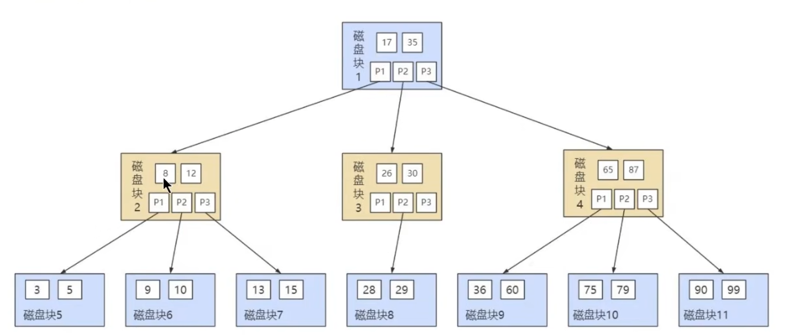
**与B+树相比，B树的非叶子节点中也是会存放数据的，就存放在关键字中，但由于在非叶子节点中同样存放了用户数据，所以B树的范围查找比起B+树而言更差**

6. B+树: 同样是多路平衡查找树，但对B树做出了改进，使其更适合文件索引系统。在此不过多介绍，相关内容可看上方介绍索引部分
为什么说B+树查找行记录最多只需要1-3次的磁盘I/O？
在InnoDB中数据页的大小为16KB，一般表的书简类型为INT（4 bytes）或者BIGINT（8 bytes），所保存的指针类型在64位操作系统中也为8 bytes，也就是说一个数据页我们大概能存下$Count_{catalog} = \frac{16KB}{8B + 8B} = 1K$个键值，当我们的B+树深度为3时，我们能存放的记录数量是$Count_{data} = 10^3 * 10^3 * 10^3 = 10^9$条。通常而言我们的B+树不会填满，因此在数据库中B+树的高度一般都是2-4层，而**MySQL的InnoDB中索引的根节点是常驻内存的**，也就是查找某一个键值的行记录最多只需要1-3次的磁盘I/O。

#### InnoDB中的数据存储结构
1. 数据库的存储结构: 页
在InnoDB，其将数据划分为若干个页，InnoDB中页的大小默认为**16KB**
磁盘与内存之间交互的基本单位就是页，也就是说一次最少从磁盘中读取16KB的数据到内存中，一次最少把16KB的数据写入内存中。一个页中可以存储多个行记录
数据页之间可以不在物理结构上相连(紧挨在一起)，只需要通过双向链表相关联即可

    另外在数据库中，才存在着**区(Extent)**，**段(Segment)**，和**表空间(Tablespace)**的概念，行、页、区、段、表空间的关系如下图所示:
    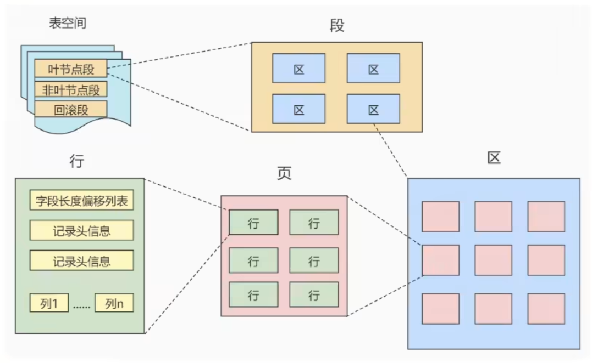
    * 区(Extent): 是比页大一级的存储结构，在InnoDB存储引擎中，一个区会分配**64个连续的页**。因为InnoDB中的页大小为16KB，所以一个区的大小是$16KB * 64 = 1MB$
    * 段(Segment): 由一个和多个区组成，区在系统文件是一个连续分配的空间，不过在段中不要求区与区之间是相邻的。**段是数据库的分配单位，不同类型的数据库对象以不同的段形式存在**
    * 表空间(Tablespace)是一个虚拟的容器，表空间存储的对象是段，从管理上能划分为**系统表空间**、**用户表空间**、**撤销表空间**、**临时表空间**。

2. 页的内部结构
页按照类型划分的话，常见的由**数据页(保存B+树节点)**、**系统页**、**Undo页**和**事务数据页**等。数据页是最常使用的页。
数据页的16KB大小被划分成了7个部分，分别是**文件头(File Header)**、**页头(Page Header)**、**最大最小记录(Infimum+supremum)**、**用户记录(User Records)**、**空闲空间(Free Space)**、**页目录(Page Directory)**、**文件尾(File Tailer)**
    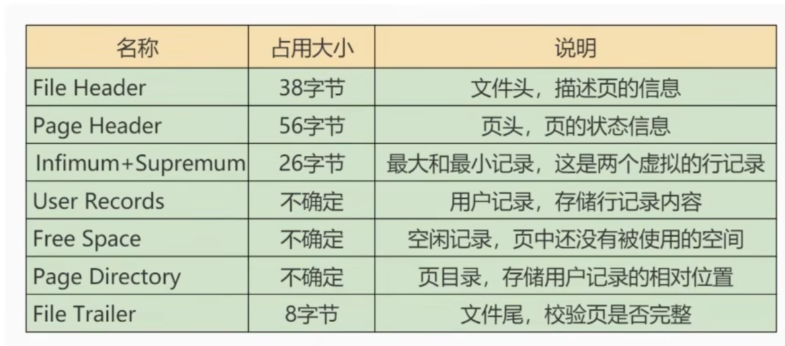
    
    1. 文件头(File Header)(38 Bytes)
        | 名称 | 占用空间大小 | 描述 |
        | ---- | ---------- | ---- |
        | `FIL_PAGE_SPACE_OR_CHKSUM` | `4B` | 页的校验和 |
        | `FIL_PAGE_OFFSET` | `4B` | 页号(全局唯一) |
        | `FIL_PAGE_PREV` | `4B` | 上一页的页号 |
        | `FIL_PAGE_NEXT` | `4B` | 下一页的页号 |
        | `FIL_PAGE_LSN` | `8B` | 页面最后修改时对应的日志序列位置，英文是: Log Sequence Number |
        | `FIL_PAGE_TYPE` | `2B` | 该页的类型 |
        | `FIL_PAGE_FILE_FLUSH_LSN` | `8B` | 尽在系统表空间的一个页中定义，代表文件至少被刷新到对应的LSN值 |
        | `FIL_PAGE_ARCH_LOG_NO_OR_SPACE_ID` | `4B` | 页属于哪一个表空间 |

    2. 文件尾(File Tailer)(8 bytes)
        | 名称 | 占用空间大小 | 描述 |
        | ---- | ---------- | ---- |
        | `FIL_PAGE_SPACE_OR_CHKSUM` | `4B` | 页的校验和 |
        | `FIL_PAGE_LSN` | `4B` | 页面最后被修改时对应的日志序列位置(LSN) |

    3. 空闲空间(Free Space)
        空闲空间+用户记录的大小是固定不变的，当用户记录越来越多时，空闲空间则是会越来越少。
        当我们想要插入一条记录的时候，都会从空闲空间中申请一个记录大小的空间划分到User Records中。
        如果空闲空间用完之后，就需要申请新的页。

    4. 用户记录(User Records)
        空闲空间+用户记录的大小是固定不变的，当用户记录越来越多时，空闲空间则是会越来越少。
        当我们想要插入一条记录的时候，都会从空闲空间中申请一个记录大小的空间划分到User Records中。
        在用户记录中，所有的记录都会按照指定的喊个是一条一条摆在User Records部分，相互之间形成单链表

    5. 最大最小记录(Infimum + Supremum)(13 bytes)
        这两条记录**不是我们自己定义的记录**，而是MySQL用于记录当前数据页中的最小值和最大值所用的，用于B+树的快速查找，所以他们并不属于User Records的一部分。
        这两条信息的构造非常简单，都是由5字节的记录头信息和8字节大小的固定部分组成的，如下表所示
        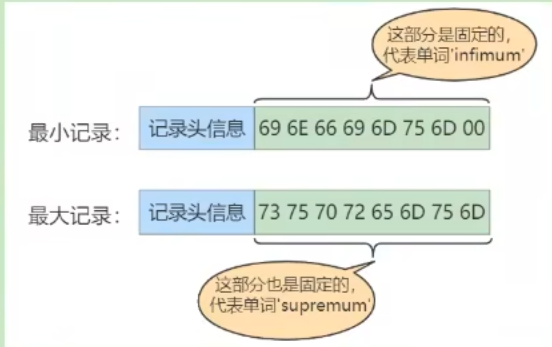

    6. 页目录(Page Directory)
        页目录是用来为链表支持二分查找而设置的用来记录所有用户记录偏移量的一个数据，由于二分查找法只能使用在数据中，因此需要这一项数据。
        当然，如果我们把所有的记录的索引列都记录在页目录中，那么这个页目录所占据的空间也会非常大，因此实际上我们是将页中的数据进行**分组**，而在页目录中记录的是每一个组索引值最大的。
        页目录里的分组：第一组是最小记录所在的分组，只有1个记录；最后一组是最大记录所在的分组，会有1-8条记录；而其他组记录数量在4-8条之间。

    7. 页面头部(Page Header)(56 bytes)
        | 名称 | 占用空间 | 描述 |
        | ---- | ------- | ---- |
        | `PAGE_N_DIR_SLOTS` | `2B` | 在页目录中的槽的数量 |
        | `PAGE_HEAP_TOP` | `2B` | 还没使用的空间的最小地址，也就是说这个地址之后是Free Space |
        | `PAGE_N_HEAP` | `2B` | 本页中记录的数量（包括最小最大以及标记为删除的记录） |
        | `PAGE_FREE` | `2B` | 第一个已经标记为删除的记录地址（各个已删除的记录通过`next_record`组成一个被删除记录链表，后面可以被重新利用） |
        | `PAGE_GARBAGE` | `2B` | 已经删除的记录占用的字节数 |
        | `PAGE_LAST_INSERT` | `2B` | 最后插入记录的位置 |
        | `PAGE_DIRECTION` | `2B` | 记录插入的方向（加入新插入的一条记录主键值比上一条记录的主键大，那么这条记录的插入方向是**右边**，反之是**左边**） |
        | `PAGE_N_DIRECTION` | `2B` | 一个方向连续插入的记录数量 |
        | `PAGE_N_RECS` | `2B` | 该页中记录的数量（不包括最小和最大记录以及被标记为删除的记录） |
        | `PAGE_MAX_TRX_ID` | `8B` | 修改当前页的最大事务ID，该值仅在二级索引中定义 |
        | `PAGE_LEVEL` | `2B` | 当前页在B+树种所处的层级 |
        | `PAGE_INDEX_ID` | `8B` | 索引ID，表示当前页属于哪个索引 |
        | `PAGE_BTR_SEG_LEAF` | `10B` | B+树叶子段的头部信息，仅在B+树的Root页中定义 |
        | `PAGE_BTR_SEG_TOP` | `10B` | B+树非叶子段的头部信息，仅在B+树的Root页中定义 |

    8. 对于**COMPACT**行格式中每一个用户数据行中记录的额外信息
        在Compact行格式下，一行数据可以被分为**记录的额外信息**和**记录的真实数据**两个部分，记录的额外信息包括以下的三个:
        1. 变长字段长度列表
            在MySQL中支持一些边长的数据类型，比如`VARCHAR(M)`，`VARBINARY(M)`，`TEXT`，`BLOB`类型，这些数据类型修饰列称为**变长字段**，由于这些变长字段中存储了多少字节的数据不是固定的，所以我们在存储真实数据的时候需要顺便把这些数据占用的字节数也存起来，因而形成了变长字段长度列表。
        2. NULL值列表
            Compact行格式会把可以为NULL的列统一管理起来，存在一个标记为NNLL值列表中，如果表中没有允许存储NULL的列，则NULL值列表也就不存在了。
        3. 记录头信息(5 bytes)
            在记录头信息中，包括了以下的字段：
            | 名称 | 大小 | 描述 |
            | ---- | ---- | ---- |
            | `delete_mask` | `1bit` | 标记该记录是否被删除 |
            | `min_rec_mask` | `1bit` | B+树的每层非叶子检点中的最小记录都会添加该标记 |
            | `record_type` |  `1bit` | 表示当前记录的类型，`0`表示普通记录，`1`表示B+树非叶节点记录，`2`表示最小记录，`3`表示最大记录 |
            | `heap_no` | `1bit` | 表示当前记录在记录堆的位置信息，第一条用户记录的heap_no是2，前面的第0条和第一条是最大最小记录 |
            | `n_owned` | `1bit` | 这个自读那记录的是页目录中每一个组中最后一条记录的有信息会存储该组一共有多少条记录 |
            | `next_record` | `1bit` | 表示下一条记录与当前记录之间的相对位置 |

            **为什么被删除的记录是修改delete_mask而不是真的去删除这条记录呢？**
            这是因为移除这一条记录需要将其他的记录进行**重新排序，从而导致性能消耗**。这些被删除的记录都会组成一个所谓的**垃圾链表**，在这个链表中的记录占用的空间称之为**可重用空间**，之后如果有新纪录插入到表中的话，可能把这些被删除记录占用的空间覆盖掉。
       
        在记录的真实数据中，除了我们自己定义的列的数据外，还会有三个隐藏列:
        | 列名 | 是否必须 | 占用空间 | 描述 |
        | ---- | ------- | ------- | ---- |
        | `row_id` | 否 | `6B` | 行ID，唯一表示一条记录 |
        | `transaction_id` | 是 | `6B` | 事务ID |
        | `roll_pointer` | 是 | `7B` | 回滚指针 |


    9. **Dynamic**和**Compressed**行格式
        在介绍Compressed和Dynamic行格式之前，我们首先需要了解以下什么是MySQL的行溢出，在MySQL中，有些变长字段的长度可以超过页面大小，比如VARCHAR(M)类型，这个类型下，VARCHAR字段最多占用的字节数是65535，也就是约等于64KB，这远远比我们16KB的页面大小要大，要存储下所有的信息，不同的行格式有着不同的格式。对于上面提到的COMPACT行格式来说，它会尽可能存储下数据，若是存不下，则使用一个20字节的指针指向剩余数据的数据页，这样子就形成了一个指针。
        而对于Compressed和Dynamic行格式而言，对于存放在BLOB中的数据采用了完全的行溢出方式。**在数据页中只存放20字节的指针，实际的数据都存放在Off Page中(溢出页)**
        而Dynamic和Compressed区别则是Compressed行格式会对数据进行`zlib`算法压缩，因此对BLOB、TEXT、VARCHAR这种大数据能更有效的存储。

    10. **Redundant**行格式
        Redundant行格式和Compact行格式非常相似，唯一的不同就是没有NULL值列表，且记录的变长字段长度列表变为字段长度偏移列表。

3. 区、段与碎片区
    1. 为什么要有区
        对于磁盘而言，除了读取速度慢的问题，还有磁盘寻道也会占用一定的时间，但磁盘寻道时间是可以通过合理安排数据存放位置减少的，比如**将多个数据页连续存放在磁盘中**，这样在读取多个页的时候寻道时间便减少了。
        而区的定义就是为了让数据页的存放不仅仅实在结构层面上连续，更是在物理层面上连续。**一个区就是在物理位置上连续的`64个页`**，因为InnoDB中一个页的大小为16KB，所以一个区的大小就为$64 * 16KB = 1MB$。
        当表数据量大时，为某一个索引分配空间时就不按照页作为分配单位了，而是**按照区为分配单位**，甚至是当表中数据特别多时，可以一次性分配多个连续的区！
    2. 为什么要有段
        对于范围查询，实际上是对B+树的叶子节点进行顺序扫描，如果我们不区分叶子节点和非叶子节点，在进行范围扫描的过程中就可能浪费一部分的I/O时间了。所以InnoDB对B+树的`叶子节点`和`非叶子节点`进行了区别对待，就是叶子节点有自己独特的区，而非叶子节点也有。而**存放叶子节点的区的集合就是`段`(`segment`)**，**存放非叶子节点的区的集合也是一个`段`**。也就是一个索引会生成2个段，一个`叶子节点段`，一个`非叶子节点段`。
        除了上述这两种段以外，InnoDB中还有为存储一些特殊的数据而定义的段，比如`回滚段`。
        在InnoDB中，段的管理是由引擎自身所完成的，DBA无法对段进行管理。
        **段实际上并不是一个物理上连续的区域，而是概念上的连续！它是由`若干个零散的页面`和`一些完整的区`组成**
    3. 为什么要有碎片区
        为了解决使用区存在的潜在空间浪费的问题，我们需要使用碎片区来解决。
        为了考虑以完整的区为单位分配给某个段对于`数据量较小`的表产生的空间浪费的情况，InnoDB提出了一个`碎片(fragment)区`的概念。**在一个碎片区中，并不是所有页都属于某一个段而存在的，而是其中部分的页属于段A，另一部分页属于段B这种形式。**
        **碎片区直属于表空间，并不属于任何一个段！**
        在存在碎片区的情况下，为某个段分配存储空间的策略是这样的: 
        * 在刚开始向表中插入数据时，段是从某个碎片区开始以单个页面为单位来分配存储空间的。
        * 当某个段已经占用了`32个碎片区页面`后，就会申请完整的区为单位来分配存储空间。
    4. 区的分类
        区大体上可以分为4中类型：
        * `空闲的区(FREE)`: 目前还没有被使用的区
        * `有剩余空间的碎片区(FREE_FRAG)`: 表示碎片区中还有可用的页面
        * `没有剩余空间的碎片区(FULL_FRAG)`: 表示碎片区中的所有页面都被使用
        * `附属于某一个段的区(FSEG)`: 每一个索引都可以分为叶子节点段和非叶子节点段
        
        其中前三种区属于独立的，直属与表空间。而处于`FSEG`状态的区是附属于某一个段的。

4. 表空间
    表空间可以看作是InnoDB存储引逻辑架构的最高层，所有的数据都存放在表空间中。
    表空间实际上是一种`逻辑容器`，表空间存储的对象是段，在一个表空间中可以有一个或多个段，但一个段直属与一个表空间。
    表空间数据库由一个或多个表空间组成，表空间管理上可以分为`系统表空间(System Tablespace)`、`独立表空间(File-per-table Tablespace)`、`撤销表空间(Undo Tablespace)`、`临时表空间(Temporary Tablespace)`。
    1. 独立表空间
        即每一张表有一个独立的表空间，也就是数据和索引信息都会保存在自己的表空间中。独立的表空间(即: 单表)可以在不同的数据库中进行**迁移**。
        **真实表空间对应的文件大小**
        对于最初是的表空间.ibd文件，其只占用了`96KB`的空间(MySQL5.7中，在8.0中是7个页面大小，这是因为8.0中的.frm文件和.ibd文件内容合并了)，相当于6个页面大小，这是因为一开始我们的表中并没有数据。随着表中的数据增多，表空间对应的文件也会变大。
    2. 系统表空间
        系统表空间与独立表空间基本类似，但由于整个MySQL进程只有一个系统表空间，在系统表空间中会额外记录一些信息，这部分是独立表空间没有的。

#### 索引的创建与设计原则
1. 索引的分类
    MySQL的索引包括`普通索引`，`唯一性索引`，`全文索引`，`多列索引`和`空间索引`等。
    * 从**功能逻辑**上分类，索引主要有4种，分别是`普通索引`，`唯一索引`，`逐渐索引`，`全文索引`。
    * 从**物理实现方式**上分类，索引可以分为两种，分别是`聚簇索引`和`非聚簇索引`。
    * 按照**作用字段个数**进行划分，可以划分为`单列索引`和`联合索引`。

    1. **普通索引**
        创建普通索引时，不添加任何限制条件，只是用于提高查询效率。这类索引能创建在**任何数据类型**上，其值是否非空或者唯一要看字段本身的约束。
    2. **唯一性索引**
        使用`UNIQUE参数`可以将索引设置为唯一性索引，在创建时，限制该索引的值是必须是唯一的，但允许有空值。**一张数据表中可以有多个唯一索引**
    3. **主键索引**
        主键索引就是一种特殊的唯一性索引，**不允许有空值**，且**一张数据表中最多只有一个主键索引**。
    4. **单列索引**
        在表中的单个字段上创建的索引。单列索引只对指定字段进行索引。单列索引可以是普通索引，也可以是唯一性索引，还可以是全文索引。只要保证索引只针对一个字段创建的就可以了。**一个表中可以存在多个单列索引。**
    5. **多列(组合，联合)索引**
        多列索引是在表的**多个字段组合**上创建的一个索引，该索引指向创建时对应的多个字段，可以通过这几个字段进行查询，**但是只有查询条件中使用了这些字段中的第一个字段时才会被使用**
    6. **全文索引**
        是目前`搜索引擎`使用的一种关键的检索技术，它能够通过`分词技术`等多种算法只能分析出文本文字中关键词的频率和重要性。

2. 创建索引
    在创建表时添加索引: `CREATE TABLE`中指定索引列
    在已经存在的表中添加索引: `ALTER TABLE`中指定索引
    1. 创建表时建立索引
        隐式的构建索引的例子: 
        ```sql
        CREATE TABLE departments (
            deptID BIGINT PRIMARY KEY AUTO_INCREMENT,   # 默认情况下主键会作为索引，作为主键索引
            deptName VARCHAR(20) NOT NULL
        );

        CREATE TABLE employees (
            employeeID BIGINT PRIMARY KEY AUTO_INCREMENT,   # 默认情况下主键会作为索引，作为主键索引
            employeeName VARCHAR(20) UNIQUE,            # 声明UNIQUE之后会使用这个列的数据生成唯一性索引
            deptID BIGINT,
            CONSTRAINT empDeptIdFK FOREIGN KEY (deptID) REFERENCES departments(deptID)  # 外键同样会生成一个索引
        );
        ```
        显式的构建索引:
        ```sql
        # 基本的语法如下
        CREATE TABLE table_name [column_name data_type] [UNIQUE | FULLTEXT | SPATIAL] [INDEX | KEY] [index_name] (column_name [lenght]) [ASC | DESC];
        ```
        * `UNIQUE`、`FULLTEXT`、`SPATIAL`可选参数，分别表示唯一索引、全文索引和空间索引
        * `INDEX`和`KEY`是同义词，用来指定创建索引
        * `index_name`指定索引的名字，可选参数，可以不指定，默认是column_name作为索引名称
        * `column_name`是需要创建索引的列的字段，必须是表中已经定义好的列
        * `length`可选参数，表示索引的长度，只有字符串类型的字段才能指定索引长度
        * `ASC`和`DESC`指定升序或者降序地存储索引值
        1. 显式创建普通索引
            举个创建普通索引的例子:
            ```sql
            CREATE TABLE book (
                bookID BIGINT,
                bookName VARCHAR(100),
                authors VARCHAR(100),
                info VARCHAR(100),
                comment VARCHAR(100),
                publicationTime YEAR,
                # 下面是声明索引
                INDEX(publicationTime)  # 根据publicationTime作为索引列创建普通索引
            );
            ```
            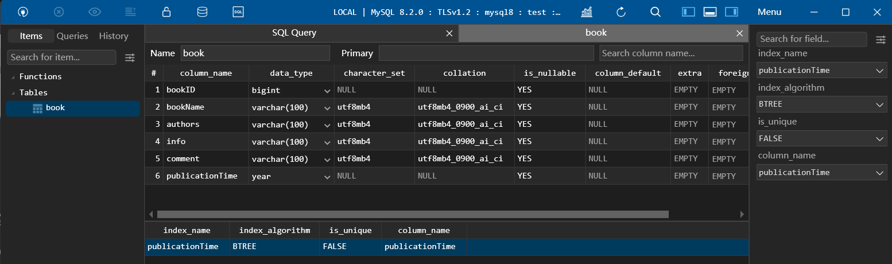
        2. 显式创建唯一索引
            举个创建唯一索引的例子:
            ```sql
            CREATE TABLE book (
                bookID BIGINT,
                bookName VARCHAR(100),
                authors VARCHAR(100),
                info VARCHAR(100),
                comment VARCHAR(100),
                publicationTime YEAR,
                # 下面是声明索引
                # 需要注意的是，创建唯一索引后comment列就有UNIQUE约束了！
                UNIQUE INDEX unique_comment_idx(comment)  # 根据comment作为索引列创建唯一索引
            );
            ```
            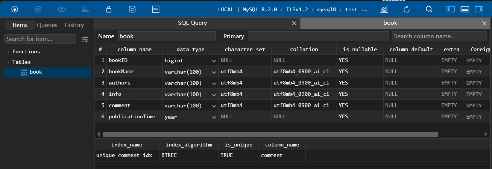
        3. 显式创建主键索引(通过定义主键约束的方式)
            和隐式的一致，并没有额外的显式创建主键索引的方法
        4. 显式创建联合索引
            举个创建联合索引的例子:
            ```sql
            CREATE TABLE book (
                bookID BIGINT,
                bookName VARCHAR(100),
                authors VARCHAR(100),
                info VARCHAR(100),
                comment VARCHAR(100),
                publicationTime YEAR,
                # 下面是声明索引
                INDEX idx_id_name_info(bookID, bookName, info)  # 根据bookID, bookName, info这三列创建联合索引
            );
            ```
            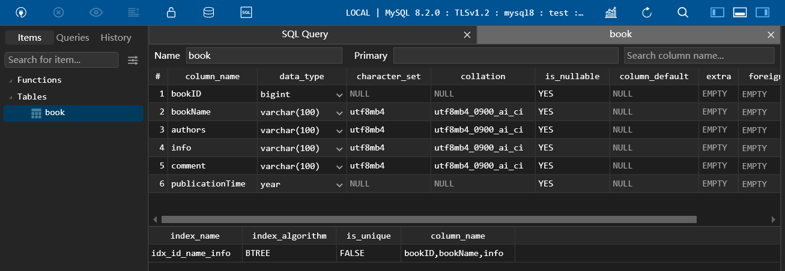
        5. 显式创建全文索引
            **`FULLTEXT`全文索引只能创建在`CHAR`、`VARCHAR`和`TEXT`类型的列上**
            举个创建全文索引的例子:
            ```sql
            CREATE TABLE book (
                bookID BIGINT,
                bookName VARCHAR(100),
                authors VARCHAR(100),
                info VARCHAR(100),
                comment VARCHAR(100),
                publicationTime YEAR,
                # 下面是声明索引
                FULLTEXT INDEX (info(50))  # 根据info的前50个字符创建全文索引
            );
            ```
            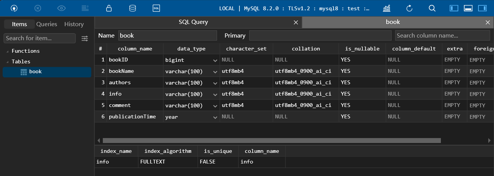
        6. 显式创建空间索引
            空间索引只能创建在`GEOMETRY`类型的字段上
            ```sql
            CREATE TABLE test (
                geo GEOMETRY NOT NULL
                SPATIAL INDEX (geo)  # 根据geo创建空间索引
            ) ENGINE=MyISAM;
            ```
    2. 在已经存在的表中添加索引
        基本语法为:
        ```sql
        ALTER TABLE table_name ADD [INDEX | UNIQUE | FULLTEXT | SPATIAL] [index_name](column_name);
        #或者
        CREATE [UNIQUE | FULLTEXT | SPATIAL] INDEX index_name ON table_name(column_name);
        ```
        
3. 删除索引
    在删除索引的时候，需要注意的是，**添加AUTO_INCREMENT约束字段的唯一性索引不能删！！**
    基本语法为:
    ```sql
    ALTER TABLE table_name DROP INDEX index_name;
    # 或者
    DROP INDEX index_name ON table_name;
    ```

4. MySQL8.0索引新特性
    1. 支持降序索引
        当我们想要倒序查询的时候通过创建倒序索引可以**极大的提高ORDER BY column DESC的效率**
    2. 隐藏索引
        通常而言，直接删除索引往往有着不小的风险，通过隐藏索引我们能告诉MySQL这个索引后面就不需要再使用了，然后我们再删除索引，这种删除方法被称为**软删除**。
        注意，当我们更新数据时，被隐藏的索引同样会进行更新，所以如果长时间不使用，应该将其删除
        * 直接创建不可见索引
            ```sql
            CREATE TABLE book (
                bookID BIGINT,
                bookName VARCHAR(100),
                authors VARCHAR(100),
                info VARCHAR(100),
                comment VARCHAR(100),
                publicationTime YEAR,
                # 下面是声明索引
                INDEX (bookName) INVISIBLE # 根据bookname创建不可见索引
            );
            ```
        * 创建表以后创建不可见索引
            ```sql
            ALTER TABLE table_name ADD [INDEX | UNIQUE | FULLTEXT | SPATIAL] [index_name](column_name) INVISIBLE;
            # 或者
            CREATE INDEX index_name ON table_name(column_name) INVISIBLE;
            ```
        * 修改现有索引的可见性
            ```sql
            # 可见到不可见
            ALTER TABLE table_name ALTER INDEX index_name INVISIBLE;
            # 不可见到可见
            ALTER TABLE table_name ALTER INDEX index_name VISIBLE;
            ```

5. 索引的设计原则
    * 哪些情况适合添加索引？添加索引的规范是什么？
        1. 字段的数值具有唯一性
            如果**某个字段是唯一性的**，就可以直接创建**主键索引**或者**唯一索引**。
            例如: 表中的ID
        2. SELECT中频繁作为WHERE查询条件的字段
            如果一个字段在SELECT语句中经常在WHERE条件中被使用到，就需要为这个字段创建一个索引。
        3. 经常GROUP BY和ORDER BY的字段
            由于索引会对数据进行排序，因此对于经常需要排序的字段而言，在构建索引后就不需要每一次调用ORDER BY都进行一次排序了。GROUP BY同理。
        4. UPDATE、DELETE的WHERE条件列
            原因与第二点类似。不过对于UPDATE来说，如果更新的字段不是作为索引的字段，速度会更快，否则由于修改字段需要同时修改索引，就会导致我们的修改时间变长。
        5. DISTINCT字段需要创建索引
            对于需要去重的字段也需要创建索引，因为在创建索引后能让字段值相同的数据排列在一起
        6. 多表JOIN连接操作时创建索引的注意事项
            * 表的连接数量**不要超过3张**，因为每增加一张就相当于增加了一层for循环
            * **对WHERE条件创建索引**
            * **对用于连接的字段创建索引，并且多张表中的类型必须一致**，否则需要使用函数进行隐式转换时，索引会失效
        7. 使用列的类型小的创建索引
            **类型小的**值得是类型大小，如`TINYINT`，`MEDIUMINT`，`INT`，`BIGINT`。这个原则的意思是，能用`TINYINT`就不用`MEDIUMINT`，能用小的就用小的。
            这样做有以下的好处：
            * 数据类型越小，查询时比较就越快
            * 数据类型越小，索引占用的空间就越少，一个数据页内能存放的数据就越多，减少磁盘I/O的次数。
        8. 使用字符串前缀创建索引
            当字符串很长的时候，我们需要考虑是不是需要将整个字符串作为索引。
            但是当我们截取字符串作为索引的时候，下面的这个SQL就很尴尬了：
            ```sql
            # 其中的name是VARCHAR类型且截取了一部分用来创建索引
            SELECT * FROM table_name ORDER BY name LIMIT 10;
            ```
            在这种情况下，因为我们是通过截取了name的一部分来创建索引的，因此这条SQL是无法使用索引的，**只能进行文件排序。**
        9. 区分度高(散列性高)的列适合作为索引
            假设我们有如下的一个列`2, 5, 8, 2, 5, 8, 2, 5, 8`，这个数列虽然有9个数，但是列的基数缺只有3。这种情况由于相同的数据太多，并不适合作为索引。
            如何判断一列的数据是否区分度高呢？我们可以通过以下的SQL语句计算
            ```sql
            SELECT COUNT(DISTINCT column_name) / COUNT(*) from table_name;
            ```
            得到的数据越接近1越好，一般超过**33%**就算是比较高效的索引了
        10. 使用最频繁的列放到联合索引的左侧
            这样可以减少需要创建的索引的数量
        11. 在多个字段都要创建索引的情况下，联合索引优于单值索引
            略

    * 不适合创建索引的情况
        1. 在WHERE(包括GROUP BY和ORDER BY)中不适用的字段不适用索引
        2. 数据量小的表最好不要使用索引(比如少于一千)，直接查找可能I/O次数更少
        3. 有大量重复数据的列上不要建立索引
        4. 避免对经常更新的表和字段创建过多的索引
        5. 不建议用无序的值作为索引
        6. 删除不再使用或者很少使用的索引
        7. 不要定义冗余或重复的索引
    
    * 索引失效的情况
        实际上，最终是不是用索引是优化器说了算，如果优化器发现不适用索引成本更低，则不会使用索引。
        首先我们假设存在这样的一个数据库，包括如下的表:
        ```sql
        # 表结构
        CREATE TABLE students (
            'id' INT(11)  PRIMARY KEY NOT NULL AUTO_INCREMENT,
            'studentNo' INT NOT NULL,
            'name' VARCHAR(20) DEFAULT NULL,
            'age' INT(3) DEFAULT NULL,
            'classID' INT(11) DEFAULT NULL,
        ) ENGINE=INNODB AUTO_INCREMENT=1 DEFAULT CHARSET=utf8mb4;
        ```
        1. 全值匹配
            假设我们有如下的一个SQL查询语句
            ```sql
            # SQL查询语句
            SELECT SQL_NO_CACHE * FROM students WHERE age = 30 AND classID = 4 AND name = 'abcd';
            ```
            对于students表，假设我们存在三种不同的索引，分别是：
            ```sql
            # 只针对age构建的索引
            CREATE INDEX idx_age ON students(age);
            # 针对age和classID构建的联合索引
            CREATE INDEX idx_age_classID ON students(age, classID);
            # 针对age，classID和name构建的联合索引
            CREATE INDEX idx_age_classID_name ON students(age, classID, name);
            ```
            那么针对我们的查询语句而言，前两种索引就会失效了，因为有更精准的索引可以帮助降低查询成本，也就是如果索引覆盖查询的值越多，成本越低，那些更广泛使用的索引就会失效。

        2. 查询的时候没有匹配最佳左前缀
            对于students表，假设我们有如下索引:
            ```sql
            CREATE INDEX idx_age_classID_name ON students(age, classID, name);
            ```
            但是我们的SQL语句是这样的:
            ```sql
            # 在这个SQL语句中没有使用age字段
            SELECT SQL_NO_CACHE * FROM students WHERE classID = 4 AND name = 'abcd';
            ```
            在这种情况下，我们的索引`idx_age_classID_name`就会失效，因为B+树实际上是用过索引中第一个字段进行创建的，如果我们的WHERE条件中不存在这第一个字段，这颗B+树将无法被利用，此时这个索引也就失效了。
            
        3. 计算、函数会导致索引失效
            假设我们有如下索引和两条效果一模一样的SQL查询:
            ```sql
            CREATE INDEX idx_name ON students(name); # 索引

            SELECT SQL_NO_CACHE * FROM students WHERE students.name LIKE 'abc%';
            SELECT SQL_NO_CACHE * FROM students WHERE LEFT(students.name, 3) = 'abc';
            ```
            在这种情况下，我们在第二条SQL语句中使用了`LEFT()`函数，这种操作会导致索引失效了，因为在B+树中索引是按照整个name字段进行创建的，而不是通过student.name的前三个字符创建的，所以完全无法利用上索引。
            同样的对于计算也会导致这种问题:
            ```sql
            SELECT SQL_NO_CACHE * FROM students WHERE students.studentNo + 1 = 100001;  # 这条索引会失效
            SELECT SQL_NO_CACHE * FROM students WHERE students.studentNo = 100000;  # 这条更好
            ```

        4. 类型转换(显式或者隐式)会导致索引失效
            假设我们有如下索引和SQL语句:
            ```sql
            CREATE INDEX idx_name ON students(name); # 索引

            SELECT SQL_NO_CACHE * FROM students WHERE name = 123; # 发生隐式转换，从VARCHAR变成INT
            SELECT SQL_NO_CACHE * FROM students WHERE name = '123'; # 索引生效
            ```
            在这种情况下，索引同样会失效。

        5. 范围条件中右边的列的索引失效
            假设我们有如下索引和SQL语句:
            ```sql
            # 索引
            CREATE INDEX idx_age_classID_name ON students(age, classID, name);

            SELECT SQL_NO_CACHE * FROM students WHERE students.age = 30 AND students.classID > 20 AND student.name = 'abc';
            ```
            在这种情况下，虽然能使用上我们的`idx_age_classID_name`索引，但是name部分是失效的，也就是在查找name='abc'的时候，虽然我们的索引中式记录了name列的信息，但是无法使用，因为在索引中name是在classID的右侧。
            **将需要使用范围查询的字段放到最右边，就能解决这个问题**
            ```sql
            CREATE INDEX idx_age_classID_name ON students(age, name, classID);
            ```
        
        6. 不等于条件导致索引失效
             假设我们有如下索引和SQL语句:
            ```sql
            CREATE INDEX idx_name ON students(name); # 索引

            SELECT SQL_NO_CACHE * FROM students WHERE student.name != 'abc';
            ```
            这种情况下无法使用索引

        7. `IS NULL`可以使用索引，但`IS NOT NULL`无法使用索引
            假设我们有如下索引和SQL语句:
            ```sql
            CREATE INDEX idx_name ON students(name); # 索引

            SELECT SQL_NO_CACHE * FROM students WHERE student.name IS NULL; # 可以使用索引
            SELECT SQL_NO_CACHE * FROM students WHERE student.name IS NOT NULL; # 不可以使用索引，相当于上面的!=符号
            ```
            同理的，`NOT LIKE`一样无法使用索引
            **要解决这个问题，我们可以通过约定好一个非法值，比如-1等，这样我们可以把NOT运算转换成EQUAL运算，这样就能使用索引了。**
        
        8. LIKE寻找通配符%开头的查找索引失效
            假设我们有如下的索引和SQL语句: 
            ```sql
            CREATE INDEX idx_name ON students(name); # 索引

            SELECT SQL_NO_CACHE * FROM students WHERE student.name = 'abc%'; # 可以使用索引
            SELECT SQL_NO_CACHE * FROM students WHERE student.name = '%abc%'; # 不可以使用索引
            SELECT SQL_NO_CACHE * FROM students WHERE student.name = '%abc'; # 不可以使用索引
            ```

        9. OR前后存在非索引的列，索引会失效
            假设我们有如下的索引和SQL语句: 
            ```sql
            CREATE INDEX idx_age ON students(age); # 索引

            SELECT SQL_NO_CACHE * FROM students WHERE age = 10 OR classID = 10; # 不可以使用索引
            ```
            要解决这个问题，我们需要给两个字段都加入索引
            ```sql
            CREATE INDEX idx_age ON students(age); # 索引
            CREATE INDEX idx_classID ON students(classID); # 索引

            SELECT SQL_NO_CACHE * FROM students WHERE age = 10 OR classID = 10; # 不可以使用索引
            ```
        
        10. 数据库和表的字符集不统一
            若是不统一，则会导致字符集的隐式转换，导致索引失效。解决方法就是统一字符集即可。


#### 性能分析工具的使用
1. 查看系统性能的参数
    使用`SHOW STATUS`语句查询一些MySQL数据库的`性能参数`、`执行频率`
    语法如下：
    ```sql
    SHOW [GLOBAL | SESSION] STATUS LIKE 'arguments';
    ```
    一些常用的性能参数如下：
    * Connections: 连接MySQL服务器的次数
    * Uptime: MySQL服务器的上线时间
    * Slow_queries: 慢查询的次数
    * Innodb_row_read: Select查询返回的行数
    * Innodb_row_inserted: 执行INSERT操作插入的行数
    * Innodb_row_updated: 执行UPDATE操作更新的函数
    * Innodb_row_deleted: 执行DELETE操作删除的行数
    * Com_select: 查询操作的次数
    * Com_insert: 插入操作的次数
    * Com_update: 更新操作的次数
    * Com_delete: 删除操作的次数

2. 统计SQL的查询成本
    一条SQL语句在执行前需要确定最终的**执行计划**，如果存在多种执行计划的话，MySQL会计算每一个执行计划所需要的成本，从中选择**成本最小**的最为最终的执行计划。
    如果我们想要查看某条SQL语句的查询成本，可以在执行完该条SQL语句后，通过查看会话中的`last_query_cost`变量值来得到当前查询的成本。它通常也是我们**评价一个查询的执行效率**的一个常用指标。这个查询成本对应的是**SQL语句所需要读取的页的数量**。
    通过以下指令可以查询上一条SQL语句的成本。
    ```sql
    SHOW STATUS LIKE 'last_query_cost';
    ```

3. 定位执行慢的SQL：慢查询日志
    MySQL的慢查询日志是用来记录MySQL中**响应时间超过阈值**的SQL语句，具体指运行时间超过`long_qurey_time`值的SQL，这些SQL语句就会被记录到查询日志当中。`long_qurey_time`的默认值为10，意思是运行10秒以上的SQL语句属于慢查询。
    **默认情况下慢查询日志是不开启的**，因为会影响性能。
    1. 首先查看慢查询日志功能是否已经开启，使用下面的命令即可
        ```sql
        SHOW VARIABLES LIKE '%show_query_log%';
        ```
    2. 开启慢查询日志功能，通过以下SQL命令：
        ```sql
        SET GLOBAL slow_query_log = 'ON';
        ```
    3. 修改响应时间的阈值
        ```sql
        SET GLOBAL long_query_time = time_in_second;    # 修改后面创建的阈值
        SET long_query_time = time_in_second;           # 修改当前SESSION的阈值
        ```
    4. 查询慢查询数目
        ```sql
        SHOW GLOBAL STATUS LIKE '%Slow_querys%';
        ```
4. 查看SQL的执行成本：`SHOW PROFILE`
    `SHOW PROFILE`可以用来查看当前会话中的SQL语句究竟都干了什么，在上面的架构篇中有所介绍。此功能也是**默认关闭状态，保存最近15次SQL语句的执行信息**。
    查看此功能是否开启：
    ```sql
    SHOW VARIABLES LIKE 'profiling';
    ```
    通过以下SQL将此功能对于该会话开启：
    ```sql
    SET PROFILING = 'ON';
    ```
    通过以下的指令查看某一行SQL的执行信息：
    ```sql
    SHOW PROFILE [column_name] [FOR QUERY query_index];
    #比如
    SHOW PROFILE cpu,block io FOR QUERY 3;
    ```
    不过`SHOW PROFILE`指令已经即将被弃用了。

5. 分析查询工具：`EXPLAIN`
    通过`EXPLAIN`关键词，我们能查看一条SQL语句在被执行时所选择的执行计划，便于我们对SQL语句进行优化。
    1. 能做什么？
        * 表的读取顺序
        * 数据读取操作的操作类型
        * 哪些索引可以被使用
        * 哪些索引被实际使用
        * 表之间的引用
        * 每张表有多少行被优化器查询
    2. 如何使用？
        在SQL语句前加上`EXPLAIN`即可。
    3. `EXPLAIN`各个列的作用
        | 列名 | 描述 |
        | ---- | ---- |
        | `id` | 在一个大的查询语句中每一个SELECT关键字都对应一个**唯一的ID** |
        | `select_type` | SELECT关键字对应的那个查询的类型 |
        | `table` | 表名，一行数据代表一个单表，若是连表查询，就会有多条数据 |
        | `partition` | 匹配的分区信息 |
        | `type` | 针对单表的访问方法 |
        | `possible_keys` | 可能用到的索引 |
        | `key` | 实际用到的索引 |
        | `key_len` | 实际使用到的索引的长度 |
        | `ref` | 当使用索引列等值查询时，与索引列进行等值匹配的对象信息 |
        | `rows` | 预估需要读取的记录条数 |
        | `filtered` | 某个表经过搜索条件过滤后剩余记录条数的百分比 |
        | `Extra` | 一些额外的信息 |

#### 连接查询的优化策略与底层原理
1. 左(右)连接
    对于左右连接来说，需要给对应的字段创建索引即可。
    但是有时候MySQL会将我们的外连接SQL语句进行重写，使其从外连接变为内连接的运行方式。此时，MySQL就有能力去选择哪一张表作为被驱动表，哪一张表作为驱动表了。通俗来说就是**小结果集驱动大结果集。**

2. 内连接
    对于内连接来说，由于两张表的地位是平等的，因此MySQL有机会决定谁是驱动表，谁是被驱动表。此时，**MySQL的优化策略就是查询开销小的表作为驱动表。** 简单来说，就是**小结果集驱动大结果集。**

#### 子查询优化
子查询虽然功能强大，但是性能却不是很好，具体的原因有以下几点：
* 执行子查询时，MySQL需要为内层查询创建一个临时表。在擦汗寻完毕后再撤掉这些表，会消耗更多的I/O和CPU资源。
* 子查询的结果集存储的临时表**不会存在索引**，所以在这些临时表上进行查询性能会受到一定的影响。
* 结果集越大的子查询，对性能的影响也就越大。

**解决方法：** 将子查询转换为JOIN查询，实在无法转换就分成多次SQL进行查询。

在子查询中，我们会碰到`EXISTS`和`IN`这两种关键词，它们都能实现同一种功能，但实际上性能上是有差别的，我们需要根据不同的情况进行选择，遵循的原则同样是**小结果集驱动大结果集。**
举个例子:
```sql
SELECT * FROM A WHERE cc IN (SELECT cc FROM B);

SELECT * FROM A WHERE cc EXISTS (SELECT cc FROM B WHERE B.cc = A.cc);
```
由于IN的实现相当于外表循环，因此当A表比较小的时候，我们选择第一种写法，执行过程类似于:
```c
for(int i = 0; i < A.size(); i++) {
    for(int j = 0; j < B.size(); b++) {
        if(A[i].cc == B[j].cc) {
            // do something
        }
    }
}
```
反过来，如果A表比较大的时候，我们选择第二种写法，此时A表相当于被驱动表，符合我们的条件，执行过程类似于:
```c
for(int i = 0; i < B.size(); i++) {
    for(int j = 0; j < A.size(); b++) {
        if(B[i].cc == A[j].cc) {
            // do something
        }
    }
}
```

#### 排序优化
如果不对进行`ORDER BY`的字段添加索引，当我们需要排序查询结果的时候，MySQL会进行`FileSort`排序，就是把数据读进内存后进行排序，带来CPU上的压力，若是文件过大，还会产生临时文件挤占硬盘I/O。
就算我们为`ORDER BY`的字段添加了索引，也存在一些情况下索引会失效，比如：
* ORDER BY时不适用LIMIT，索引会失效(返回的列索引无法覆盖的情况下)
    比如说如果我们不指定取前多少行数据，那么这个SQL语句就会返回整个数据表的内容，这是索引存不存在也就没有意义了。SQL如下：
    ```sql
    CREATE INDEX idx_age_classID ON students(age, classID); # 索引

    # 索引会失效，因为返回的内容是整个表，没有必要用索引。
    # 并且由于我们要返回的列数据超过了上面声明的非聚簇索引的覆盖范围，会导致大量的回表操作
    SELECT SQL_NO_CACHE * FROM students ORDER BY age, classID;

    # 会使用索引`idx_age_classID`，因为不需要回表
    SELECT SQL_NO_CACHE age, classID FROM students ORDER BY age, classID;

    # 会使用索引`idx_age_classID`，因为数据量被限制了，回表导致的性能影响不大
    SELECT SQL_NO_CACHE * FROM students ORDER BY age, classID LIMIT 10;
    ```
* ORDER BY的顺序错误时，索引会失效
    比如说存在一个索引是这样定义的
    ```sql
    CREATE INDEX idx_age_classID ON students(age, classID, studentNo); # 索引

    # 无法使用索引，不符合索引的最左前缀原则
    SELECT * FROM students ORDER BY classID LIMIT 10;

    # 索引失效，因为顺序不一样
    SELECT * FROM students ORDER BY age, studentNo, classID LIMIT 10;   

    # 索引失效，因为B+树种的索引是升序存的，除非索引改成降序存储
    SELECT * FROM students ORDER BY age DESC, classID LIMIT 10;   

    # 能使用索引，MySQL会从B+树的最右边的叶子节点开始倒序查找
    SELECT * FROM students ORDER BY age DESC, classID DESC LIMIT 10;   
    ```

#### 索引下推(Index Condition Pushdown)
实际上就是在根据某一个条件在索引完成搜索后，不着急进行回表，在过滤后的结果集中进行下一个条件的过滤，从而减少潜在的I/O访问。
举个最简单例子就是
```sql
CREATE INDEX idx_key1 ON table1(key1);
SELECT * FROM table1 WHERE key1 > 'z' AND key1 LIKE '%a';
```
在这一句SQL中，优化器在使用后idx_key1过滤过后，并不会直接回表查询剩余数据再进行条件`LIKE '%a'`的过滤，而是现在结果集中进行条件`LIKE '%a'`的过滤，再进行回表。
再来一个一般一点的例子：
```sql
CREATE TABLE person(
    'firstname' VARCHAR(10) NOT NULL,
    'lastname' VARCHAR(10) NOT NULL,
    'zipcode' VARCHAR(10) NOT NULL,
    KEY 'idx_name_zip' ('firstname', 'lastname', 'zipcode');
);

SELECT * FROM person WHERE firstname = '王' AND lastname = '%五%' AND zipcode = '%0123%';
```
在上述的SQL中，索引`idx_name_zip`只能使用到`firstname`部分的检索，而后面两个条件无法使用索引。在实际的执行中，MySQL不会在使用索引过滤完firstname后直接回表进行查找，而是在过滤出来的结果集中完成对`lastname`和`zipcode`条件的过滤，这是因为我们的索引覆盖了lastname和zipcode两个字段，通过直接在结果集中进行过滤我们可以减少I/O次数。

#### 数据库设计范式
一般来说数据库表的设计满足到第三范式或者巴斯科德范式就可以了，在实际开发中，为了满足一些查询性能，有时候还可能会破坏范式规则，称为`反范式化`。

数据库中键和相关属性的概念:
* `超键`: 能唯一标识元组的属性集
* `候选键`: 如果超键不包含多余属性，那么这个超键就是候选键
* `主键`: 用户可以从候选键中选择一个作为主键
* `外键`: 如果数据表R1中的某些属性不是R1的主键，而是另一个数据表R2的主键，那么这个属性集就是数据表R1的外键
* `主属性`: 包含在任一候选键中的属性称为主属性
* `非主属性`: 与主属性相对，指的是不包含在任何一个候选键中的属性

下面是数据库的六大范式的内容:

1. 第一范式(1NF)
第一范式主要保证了数据库中每个字段的值必须具有**原子性**，也就是数据表中的每个字段的值为**不可拆分的**最小数据单元。比如: 一个电话字段存储两个电话，此时就不符合第一范式，因为两个电话可以被拆分

2. 第二范式(2NF)
第二范式要求，在满足第一范式的基础上，还要额外满足数据表里的每一条数据记录，都是可唯一标识的。而且所有非主键字段，必须完全依赖主键，不能只是依赖主键的一部分。
举个例子: (学号，课程号，成绩)关系中，(学号，课程号)可以决定成绩，但是光凭学号无法确定成绩，课程号也同理，所以成绩对于学号和课程号而言就是完全依赖关系。

3. 第三范式(3NF)
第三范式就是阿紫满足第二范式要求的基础上，确保数据表中每一个非主键字段都和主键字段直接相关，也就是说，**要求数据表中的所有非主键字段不能依赖于其他非主键字段**。(即，不能存在A非主键字段依赖于B非主键字段，然后B非主键字段再依赖于C主键字段，形成一个传递依赖的关系)。

4. 巴斯-科德范式(BCNF)
若一个关系达到了第三范式，并且只存在一个候选键，或者它的每一个候选键都是单属性的，则该关系自然达到BC范式。
一般来说，数据库到达第三范式和BC范式就可以了

5. 第四范式(4NF)
    要了解第四范式，首先我们要了解一下什么是多值依赖:
    * `多值依赖`即属性之间的一对多关系，记为K->->A
    * `函数依赖`即单值依赖，不能表达属性之间一对多的关系
    * `平凡的多值依赖`全集U=K+A，一个K可以对应多个A，即`K->->A`，此时整个表就是一组**一对多关系**
    * `非平凡的多值依赖`全集U=K+A+B，一个K可以对应多个A，也可以对应多个B，A与B之间相互独立，即`K->->A`，`K->->B`。**整个表有多组一对多关系**

    第四范式即是在满足巴斯科得范式的情况在，消除非平凡切非函数依赖的多值依赖（即把同一表内的多对多关系消除）
    举个例子：
    假设我们有个表叫**职工表(职工编号，职工孩子姓名，职工选修课程)**
    在这个表中，一个职工编号可能会存在多个职工孩子姓名。同时一颗职工可能也会存在多个选修课程，即存在多值依赖，不符合第四范式。
    要使其符合第四范式，我们需要将这一个表拆分成两个表: **职工表1(职工编号，职工孩子姓名)**，**职工表2(职工编号，职工选修课程)**

6. 第五范式(完美范式)
    在满足第四范式的基础上，消除不是由候选键所蕴含的连接依赖。**如果关系模式R中的每一个连接依赖均由R的候选键所隐含，则称此关系模式符合第五范式**
    这个范式基本没有实际意义，只存在与理论研究当中。


使用范式的优点: 数据的标准化有助于消除数据库中的**数据冗余**，第三范式通常被认为是在性能、扩展性、数据完整性方面达到了最好的平衡。

使用范式的缺点: 范式的使用可能会导致查询效率的下降以及索引的失效。因为通常而言应用范式意味着我们需要进行多张表联合查询，这通常会导致无法使用索引的情况出现。

**反范式化:**
有的时候我们不能简单的按照范式进行数据库的设计，因为有些数据看似冗余，实际上对业务非常重要。这个时候就要进行反范式化，让数据库设计服务于业务。


### MySQL 事务(Transaction)
#### 什么是事务
事务是一组逻辑操作单元，使数据从一种状态转换为另一种状态。这个操作单元保证了即使出现故障，都不能改变事务的工作方式。一个事务要么回滚什么操作都不执行，要么COMMIT将所有操作都完成后提交。
举个例子，一个银行帐户A要给另一个银行账户B转账100元。
此时：
* 我们需要即给帐户A减100元，又要给帐户B加100元
* 这两个操作要么都完成，要么都不完成

#### 事务的ACID特性(Atomicity, Consistency, Isolation, Durability)
* 原子性(Atomicity)
    原子性指的就是事务是一个**不可分割的**工作单位，要么都执行，要么都不执行，不存在中间的状态。

* 一致性(Consistency)
    一致性是指，数据从**一个合法性的状态**变成**另外一个合法性的状态**。这种状态是语义上的而不是语法上的，跟具体的业务有关。
    什么是合法性呢？这个合法性是由我们自定的合法状态，比如说还是上面的转账的例子，如果一次转账我们只给A减了100元但是没给B加上100元，此时我们的状态就是不合法的。这种就称之为语义。

* 隔离性(Isolation)
    事务的隔离性指的是一个事务的执行**不能被另一个事务干扰**，即一个事务内部的操作及使用的数据对并行的其他事务是隔离的，并行执行的各个事务之间不能互相干扰。
    举个例子，假设存在两个转账请求，一个是帐户A给帐户B转100块，第二个是帐户C给帐户A转100块。
    此时如果我们不能保证事务的隔离性，可能会存在第二个读到的A的余额是帐户A转账给B 100块钱之前的余额，此时，在完成两个事务后，A的余额就不对了，会额外多出来100块。

* 持久性(Durability)
    持久性指的是，一但我们的事务被提交了，它对数据的修改就是永久性的。

#### 事务的状态
MySQL根据事务所执行的不同阶段将其分为了大致的几个状态：
* 活动的(active)
    当前事务正在执行的过程中，我们就称其为**活动的**。
* 部分提交的(partially committed)
    当事务中的最后一个操作执行完成后，由于操作都在内存中执行，还没有将结果写回硬盘当中去的这个阶段，称为**部分提交的**阶段。
* 失败的(failed)
    当事务处于**活动的**和**部分提交的**过程中，发生了一些错误导致无法继续执行，或者人为的进行了停止，我们称这种事务为**失败的**。
* 终止的(aborted)
    如果事务的一部分变为了失败的状态，就需要将已经修改了的部分回滚到事务执行前的状态。当回滚操作执行完毕后，原本的失败的事务就成为了**终止的**状态下的事务。
* 提交的(committed)
    将处于部分提交状态下的事务进行提交写入磁盘中后，这个事务的状态就变为了**提交的**。

#### 显式事务和隐式事务
1. 显式事务
    * 如何开启？
        使用关键字：`START TRANSACTION`或者`BEGIN`
        其中`START TRANSACTION`后面可以跟`READ ONLY` / `READ WRITE`(默认) / `WITH CONSISTENT SNAPSHOT`等控制语句。
    * 如何结束？
        使用关键字`COMMIT`进行提交或者使用`ROLLBACK`进行回滚

2. 隐式事务
    隐式事务与MySQL中的一个叫做`autocommit`的变量有关，当这个变量的值是ON的时候，所有的单条增删改操作都会自动的进行提交，相当于一条增删改操作都是一个单独的事务。

#### 4种隔离级别
在SQL当中，存在着4中隔离等级：
* `READ UNCOMMITTED`
    读未提交，在这个隔离等级，所有事务**都可以看到其他未提交的事务所做的修改**。不能避免脏读、不可重复读和幻读的问题。
* `READ COMMITTED`
    读已提交，在这个隔离等级，**一个事务只能看到已经提交过后的的事务所作出的改变**。这是绝大多数数据库的默认隔离等级(不是MySQL的默认隔离等级)。可以避免脏读，但不能避免不可重复读和幻读的问题。
* `REPEATABLE READ`
    可重复度，在这个隔离等级，在事务A读到一条数据后，此时事务B对该数据进行了修改并提交，**此时事务A再次尝试读取同一条数据，读到的还是事务B提交修改之前的数据信息**。即一个事务在开始的时候会创建一个数据库快照，读取的都是快照内的内容。
* `SERIALIZABLE`
    表示完全的串行，在一个事务运行期间，禁止其他事务运行。


### MySQL 日志与备份