# MySQL 基础知识

## SQL的分类
* **DDL(Data Definition Language)**: ``CREATE`` | ``ALTER`` | ``DROP`` | ``RENAME`` | ``TRUNCATE``
* **DML(Data Manipulation Language)**: ``INSERT`` | ``DELETE`` | ``UPDATE`` | ``SELECT``
* **DCL(Data Control Language)**: ``COMMIT`` | ``ROLLBACK`` | ``SAVEPOINT`` | ``GRANT`` | ``REVOKE``

### DDL的使用
DDL的操作一旦执行，就不可回滚
1. ``CREATE``: 创建数据库，表等信息
    ```sql
    CREATE DATABASE database_name # 创建数据库
    CREATE TABLE table_name(field1 field1type, field2 field2type, ...) # 创建数据表
    ```
2. ``ALTER``:
3. ``DROP``:
4. ``RENAME``:
5. ``TRUNCATE``: 删除指定表中的所有数据，保留表结构，数据不可以使用``ROLLBACK``回滚
    ```sql
    TURNCATE TABLE table_name;
    ```


### DML的使用
DML在默认情况下，一旦执行，也是不能回滚的，想要实现回滚功能，需要在执行DML前执行
```sql
SET autocommit = FALSE;
```
1. **DELETE**: 删除指定表中的数据，就算清空所有数据，也能保留表结构，可以回滚
    ```sql
    DELETE FROM table_name (WHERE condition);
    ```

### DCL的使用
1. **COMMIT**: 提交数据，一旦执行``COMMIT``，则数据就被永久保存在数据库中了，意味着不可以被回滚
2. **ROLLBACK**: 回滚数据，一旦执行``ROLLBACK``，则可以实现数据的回滚

## MySQL 数据类型

## MySQL 高级特性

### MySQL的配置
#### 1. 默认字符集
在MySQL8.0中，默认字符集是utf8mb4，意味着数据库中能直接存储中文等复杂字符信息。而在MySQL5.7中，默认字符集是latin1，这个字符集不包含中文，假如我们尝试插入中文信息，在MySQL5.7中会出现错误。
为了解决MySQL5.7默认不支持中文的问题，第一个方法，我们可以在后端将中文信息使用**Base64编码**将信息转换为只用latin1中的字符就可以表示的形式再存入数据库。
第二个方法，我们可以修改默认字符集
```sh
vim /etc/my.conf #进入mysql在linux中的配置文件
```
在文件的最后加上
```sh
character_set_server=utf8 #配置字符集
```
最后重启MySQL服务
如果要修改现有的数据表的字符集，可以使用以下指令
```sql
ALTER TABLE table_name CONVERT TO CHARACTER SET 'utf8'; # 修改现有数据表的字符集
```

#### 2. 各个级别的字符集
在MySQL上有4个级别的字符集和比较规则，分别是：
* 服务器级别(*_server): 一个mysql服务器会有一个默认的字符集设置，可通过上面提到的方法进行修改
* 数据库级别(*_database): 每一个database都可以设置自己的字符集，当创建数据库时没有指定字符集，这个数据库的字符集会跟随服务器级别的字符集
* 表级别: 每一张数据表都可以有自己的字符集，当我们在创建表的时候没有指定字符集，这个表的字符集就会跟随数据库级别的字符集
* 列级别: 我们可以为数据的每一列都单独设置一个字符集，当我们在创建列的时候没有指定字符集，这个列的字符集会跟随表级别的字符集

查看所有级别的字符集，我们可以通过以下的sql命令实现
```sql
SHOW VARIABLES LIKE 'character%'
```
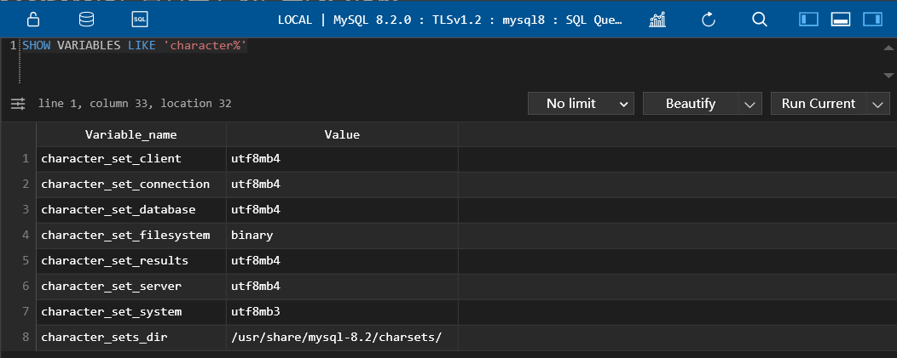

#### 3. 请求到响应过程中字符集的变化
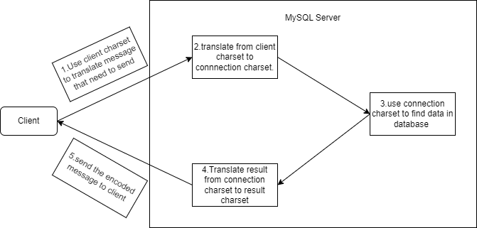
需要注意的是，发送请求的客户端的字符集需要和MySQL Server的``character_set_client``保持一致，而接受响应的客户端的字符集需要和MySQL Server中的``character_set_results``保持一致，否则会出现乱码。

#### 4. SQL的大小写规范
在SQL中，分为case sensitive和case insensitive两种，第一种表示大小写会影响到实际的查询，而第二种则相反，举个例子，假设我们有个数据库名字叫dbtest，在case sensitive的情况下：
```sql
USE dbtest; # 正常访问dbtest database
USE dBtest; # 报错，无法访问
```
而在case insensitive的情况下：
```sql
USE dbtest; # 正常访问dbtest database
USE dBtest; # 同样能访问dbtest database
```
默认情况下，`Windows系统是case insensitive`，而`Linux系统下是case sensitive`，通过使用以下SQL我们可以查看这一参数：
```sql
SHOW VARIABLES LIKE '%lower_case_table_names%'; # 检查当前SQL是否大小写敏感
```
`此参数默认为0，表示大小写敏感`，当参数为1时，表示大小写不敏感

#### 5. sql_mode 设置
查看当前的sql_mode:
```sql
SELECT @@session.sql_mode;  # 查看当前MySQL的sql_mode
```
**宽松模式**: 在这个模式下，即使我们在插入数据的时候给了一个错误的数据，也可能会被接受，比如我有一个表：
```sql
CREATE TABLE users(username, char(10));
```
我们可以看到，username这个field的长度应该是10，但是在宽松模式下，如果我们插入例如`0123456789abcd`，已经超过了10这个长度，SQL并不会报错，而是会截取前10个字符存入数据库中。
```sql
INSERT INTO users (username) VALUES ('0123456789abcd'); # 不会报错
```
**严格模式**: 对于上面这种情况，在严格模式下则是会报错
```sql
INSERT INTO users (username) VALUES ('0123456789abcd'); # 会报错
```

#### 6. MySQL的数据目录（数据都是存档在Linux的哪个目录下？）
##### 6.1 MySQL数据库的存放路径
`/var/lib/mysql/`: 这个目录下存放的是通过`CREATE DATABASE database_name`创建的数据库(database)文件夹
实际上，这个文件夹的路径可以通过SQL语句查询查看：
```sql
SHOW VARIABLES LIKE 'datadir'; # 查看数据库文件路径
```
`/usr/bin/`和`/usr/sbin/`: 这个目录下存放的是所有Linux的可执行指令，包括MySQL的指令的可执行文件
`/usr/share/mysql-8.0/`: 这个目录下存放的是MySQL命令及配置文件
`/etc/`: 用来存放`my.cnf`配置文件
##### 6.2 MySQL系统自带的数据库
* `mysql`
    MySQL系统自带的核心数据库，存储了MySQL的**用户账户和权限信息，一些存储过程、事件的定义信息，一些运行过程中产生的日志文件，一些帮助信息以及时区信息等**
* `information_schema`
    MySQL系统自带的数据库，保存着MySQL服务器**维护的所有其他数据库的信息**，比如有哪些表，哪些视图，哪些触发器，哪些列，哪些索引。在这个数据库中还包括一些以`innodb_sys`开头的表，用于表示内部系统表
* `performance_schema`
    MySQL系统自带的数据库，保存着MySQL服务器运行过程中的一些状态信息，可以用来**监控MySQL服务的各类性能指标**。包括统计最近执行了哪些与具有，在执行过过程中的每一个阶段都花费了多长时间，内存的使用情况等
* `sys`
    MySQL系统自带的数据库，这个数据库主要是通过**视图**的形式把`information_schema`和`performance_schema`结合起来，帮助系统管理员和开发人员监控MySQL的技术性能

##### 6.3 数据库在文件系统中的表示（Innodb）
正如我上面所述，所有的数据库文件夹是存放在`/var/lib/mysql/`这个路径下的，我们可以在这文件加下找到诸如`mysql`，`sys`，`performance_schema`等文件夹，也包括我们自己创建的database文件夹。
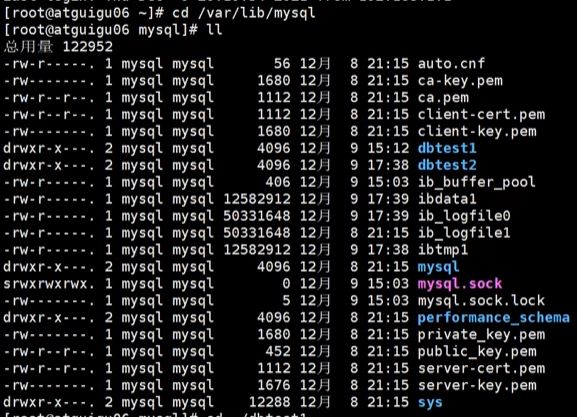
我们可以进入数据库文件夹，在MySQL5.7版本下，我们会发现每一个数据表对应着两个文件，`table_name.frm`和`table_name.ibd`，其中frm文件是负责存放表结构的，而ibd则是负责存放对应的数据，以及一个额外的`db.opt`文件，这个文件负责存放该数据表的一些默认设置，如字符集设置、比较规则等。
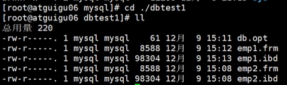
而在MySQL8.0版本下，我们会发现一个数据表只对应了一个`table_name.ibd`文件，同时也没有了`db.opt`，实际上是所有的5.7版本多出来的文件所存储的信息都整合到了.ibd文件当中

##### 6.4 数据库在文件系统中的表示（MYISAM）
和Innodb引擎一样，数据库文件夹也是存放在`/var/lib/mysql/`这个路径下的，和Innobd相比，在MySQL5.7版本下，除了.frm文件外，另外的两个文件是`table_name.MYD`和`table_name.MYI`，实际上这两个文件存储的信息就等于在Innodb中的.ibd文件
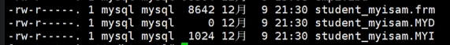
而在MySQL8.0版本下，数据表依旧是分开存储的，.MYD和.MYI保持不变，而.frm文件则变为了.sdi

#### 7. Mysql的配置文件

配置文件格式
在MySQL的配置文件中，启动选项被划分为若干组，每一个组有一个组名，用中括号`[]`括起来，如下所示
```properties
[server]
# some properties

[mysqld]
# some properties

[mysqld_safe]
# some properties

[client]
# some properties

[mysql]
# some properties

[mysqladmin]
# some properties
```
每一个propertiy有两种格式，分别是
```properties
[server]
option1             # only key
option2=value2      # key-value format
```
#### 8.MySQL的用户与角色管理

### MySQL 架构

#### 1. Mysql的整体架构
MySQL是典型的CS架构，客户端向服务器进程发送一段文本（SQL语句），服务器处理后再向客户端发送一段文本（处理结果），我们以查询请求为例，具体流程如下图所示：
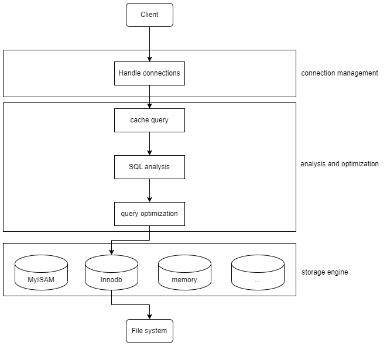
下面这张图能很好的展示展开后的MySQL5.7的架构

* `Connectors`: 表示MySQL服务器以外的客户端程序（与各个语言相关，图JDBC是Java用来链接服务器的库）
* `Services & Utilities`: 基础服务组件
* `Connection Pool`: 提供了多个用于客户端与服务器端进行交互的线程
* `SQL Interface`: 接受SQL指令并且返回查询结果的
* `Parser`: 用于解析SQL Interface传过来的SQL指令，包括：语法解析、语义解析，最终生成语法树
* `Optimizer`: **核心组件**，对SQL进行优化，并生成一个`执行计划`
* `Cache`: 以Key-Value的形式缓存查询结果 **MySQL8.0已废除**
* `Pluggable Storage Engines`: 与操作系统的文件系统进行交互，真正在文件系统中进行数据读取的实际上是Storage Engines
* `File System`: 操作系统提供的文件系统

整体上，MySQL分为**连接层**，**服务层**和**引擎层**，连接层包括Connection Pool，服务层包括SQL Interface、Parser、Optimizer和Cache，引擎层指的是Pluggable Storage Engines。

#### 2. SQL的执行流程

一个SQL语句的大致的执行顺序是怎么样的呢？
`1.在客户端使用如JDBC等库发送SQL语句到MySQL服务器中` -> `2.在Connection Pool中创建线程，建立连接` -> `3.调用相关的SQL Interface` -> `4.在Cache中查询是否有已经存在的一摸一样的查询结果（deprecated in Mysql8.0）` -> `5.Parser解析SQL语句，生成语法树` -> `6.在Optimizer对SQL进行优化（逻辑上与物理上（使用索引））` -> `7.调用Storage Engine的API进行查找` -> `8.在文件系统进行查找` -> `9.将查询结果缓存在Cache中（deprecated in Mysql8.0）` -> `10.将数据返回到客户端`

在MySQL Server中，大致分为以下几步: 
1. 查询缓存: Server如果在查询缓存(Cache)中发现了这条sql语句，就会直接将结果返回给客户端。如果没有，则进入解析器阶段。**由于缓存命中率太低，在MySQL8.0中已经被废弃**
2. 解析器: 在解析其中对SQL语句进行语法分析，语义分析(编译原理)
3. 优化器: 在优化其中会确定SQL要做什么，比如是根据`全表检索`还是`索引检索`等，并生成一个执行计划。为什么要有优化器？因为一条查询可以有很多种执行方式，最后都返回相同的结果。**优化器的作用就是找到这其中最好的执行计划**
在优化器中，可以分为**逻辑查询**和**物理查询**优化阶段。
**详细请看 MySQL索引以及调优篇**
    * 逻辑查询就是通过改变SQL语句的内容使得查询更加高效，同时为物理查询优化提供更多的候选执行计划。通常采用的方式是对SQL语句进行`等价变化`，对查询进行`重写`，对查询重写的数学基础是关系代数。对条件表达式进行等价谓词重写，条件简化，对视图进行重写，对子查询进行优化，对连接语义进行了外连接消除、嵌套链接消除等。
    * 物理查询优化是基于关系代数进行的查询重写，而关系代数每一步都对应着物理计算，这些物理计算往往存在这多种算法，因此需要计算各种物理路径的代价，从中选择代价最小的作为执行计划。在这个阶段里，对于单表和多表连接的操作，需要高效的`使用索引`，提升查询效率。
4. 执行器: 当优化器产生一个执行计划后，就会将执行计划交到执行器中。在执行计划前需要去判断用户是否`具有执行权限`，也就意味着**执行权限的检查是发生在执行器阶段的**。在MySQL8.0以下版本，如果设置了查询缓存，就会在这个阶段将查询结果进行缓存。
如果用户有执行权限，则执行器会开始调用存储引擎(Pluggable Storage Engine)的API进行数据的查询。

在MySQL中如何实际的查看一个SQL语句的执行过程呢？首先，我们需要将MySQL的profiling的值设置为1（默认值为0）
```sql
SET profiling=1;
```
设置完成后我们使用如下SQL语句进行查询，查看是否修改成功
```sql
SELECT @@profiling;
```
若结果如下图所示，则表示修改成功
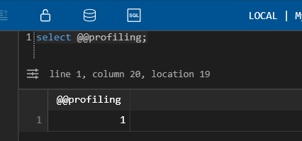
随后我们随便执行一些SQL语句，比如：
```sql
select * from users;
```
随后，我们可以使用以下的SQL来查询我们的SQL语句执行记录
```sql
SHOW profiles;  # 查看执行过的SQL
```
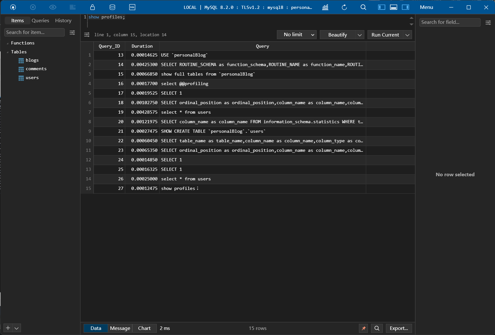
如果我们想查看具体某一个SQL语句的细节呢？如下的两条SQL语句能实现这一个功能：
```sql
SHOW profile;                       # 查询最后一句SQL的执行过程
SHOW profile for query query_id;    # 查询具体某一句SQL的执行过程
```
](MySQL_images/show_profile.png)

#### 3. 存储引擎
存储引擎负责控制数据表的存储格式并且提供一系列的API完成帮助MySQL服务层获取相关数据。简而言之，存储引擎就是表的类型，也可以称为表管理器。

1. InnoDB引擎: 具备**外键功能**的**事务**存储引擎
    * InnoDB是MySQL的默认事务引擎，被设计用来处理大量短期事务。可以确保事务的完整提交(Commit)和回滚(Rollback)。
    * **除非有特别原因需要使用其他存储引擎，否则应该优先考虑InnoDB!**
    * 对于单条数据的写性能较差
    * InnoDB的缓存需要存储索引以及真实数据，对内存的要求比较高

2. MyISAM引擎:
    * 不支持**事务**、**行级锁**、**外键**，且由于不支持事务，**崩溃后无法安全恢复**
    * 访问的速度比InnoDB**快**
    * 对数据统计有额外的常数存储。故而使用`COUNT(*)`速度很快

3. 对比

    | 对比项 | MyISAM | InnoDB |
    | ------- | ------- | ------- |
    | 外键 | 不支持 | 支持 |
    | 事务 | 不支持 | 支持 |
    | 行表锁 | **表锁**，即使操作一条数据也会锁住整个表，**不适合高并发** | **行锁**，操作时只锁一行，不对其他行有影响 |
    | 缓存 | 只缓存索引，不缓存真实数据 | 不仅缓存索引还要缓存真实数据，对内存要求要求较高，而且内存大小对性能有决定性的影响 |
    | 自带系统表使用 | Yes | No |
    | 关注点 | 性能：节省资源、消耗少、简单业务 | 事务：并发写、事务、更大资源 |
    | 默认安装 | Yes | Yes |
    | 默认使用 | No | Yes |

4. Archive引擎: 用于数据存档
    * 这个引擎仅支持数据的插入和查询，行被插入后不能再被修改
    * 插入的效率很高，但查询的效率较差
    * 存入的数据会被压缩存储，与MyISAM相比占用空间大约小**75%**，与InnoDB相比大约小**83%**
    * 采用行级锁，支持`AUTO_INCREMENT`列属性
    * 适合用作**日志和数据采集（归档）**类应用，适合存储**大量的独立的作为历史记录的数据
    * 下面是Archive存储引擎的功能：

        | 特征 | 支持 |
        | ---- | ---- |
        | B树索引 | 不支持 |
        | 备份/时间点回复（在服务器中实现，不是在存储引擎） | 支持 |
        | 集群数据库支持 | 不支持 |
        | 聚集索引 | 不支持 |
        | 压缩数据 | 支持 |
        | 数据缓存 | 不支持 |
        | 加密数据（加密功能在服务器中实现） | 支持 |
        | 外键支持 | 不支持 |
        | 全文检索索引 | 不支持 |
        | 地理空间数据类型支持 | 支持 |
        | 地理空间索引支持 | 不支持 |
        | 哈希索引 | 不支持 |
        | 索引缓存 | 不支持 |
        | 锁粒度 | 行锁 |
        | MVCC | 不支持 |
        | 存储限制 | 没有任何限制 |
        | 事务 | 不支持 |
        | 更新数据字典的统计信息 | 支持 |

5. Blackhole引擎: 丢弃写操作，读操作会返回空内容
    * Blackhole引擎没有实现任何存储机制，会**丢弃所有插入的数据**，不做任何保存
    * 但服务器会记录Blackhole表的日志，所以可以用于复制数据到备库，或者简单的记录到日志。**不推荐**

6. CSV引擎: 存储数据时，以逗号分割各个数据项
    * 可以将普通的CSV文件作为MySQL的表来处理，但不支持索引
    * CSV可以作为一种数据交换的机制，非常有用
    * CSV存储的数据可以直接在操作系统里，用文本编辑器或者Excel读取
    * 对于数据的快速导入导出是有明显优势的

7. Memory引擎: 置于内存的表
    * 将数据存储在内存中，速度快，但系统崩溃时会丢失数据（内存的特点）
    * Memory引擎同时支持**哈希索引**和**B+树索引**
    * Memory表至少要比MyISAM表快一个数量级（DRAM和硬盘的对比）
    * Memory表的大小是受限制的，主要取决于`max_rows`和`max_heap_table_size`这两个参数的限制
    * Memory表的表结构存在于硬盘中，但数据存在于内存中

### MySQL 索引及调优
#### 索引的数据结构
1. 为什么使用索引
    索引是存储引擎用于快速查找到数据记录的一种数据结构，如同一本书的目录一样，通过目录我本就能快速找到需要的内容而不需要一页一页翻看确认。在MySQL中也一样，进行数据查找时，首先**查看查询条件是否命中某条索引**，符合这通过索引查找，如果**不符合则需要全盘扫描**，即一条一条记录地查找。
    通过建立索引，我们能极大的减少磁盘的IO次数，加快查询效率。

2. 索引的概念
    在MySQL中索引的定义为: **索引（index）是帮助MySQL高效获取数据的数据结构**
    索引本身是数据结构，可以简单理解为`排好序的快速查找数据结构`，满足特定的查找算法。
    **索引是在存储引擎中实现的**，因此每种存储引擎的索引不一定完全相同，并且每种存储引擎不一定支持所有索引类型。同时，存储引擎可以定义每个表的`最大索引数`和`最大索引长度`。每个存储引擎支持每个表**至少16个索引**，总索引长度**至少为256字节**。

3. 索引的优点
    * **降低数据库的磁盘I/O成本**
    * 通过创建索引，可以保证数据库表中的每一行**数据的唯一性**
    * 可以提高有依赖关系的子表和父表的联合查询，加速**表和表之间的连接**
    * 在使用分组和排序进行数据查询时，可以显著**减少查询中分组和排序的时间**，降低CPU的消耗

4. 索引缺点
    * **创建和维护索引需要耗费时间**，并且随着数据量的增加，所耗费的时间也会增加
    * **索引需要占用磁盘空间**，如果有大量索引，索引文件可能就比数据文件更快到达最大文件尺寸
    * 虽然提高了查询速度，同时却会**降低更新表的速度**。因为当对表中的数据进行增加、删除和修改时，索引也要动态地维护

5. 索引的简单设计思路
    在MySQL中，数据表实际上是分页存储的，在磁盘上的地址并不连续。每一个**数据页的大小为16KB**。
    
    设想一种情况，假设我们有一个数据表的定义如下:
    ```sql
    CREATE TABLE users(userId BIGINT AUTO_INCREMENT, userName varchar(255), PRIMARY KEY (userId)) ROW_FORMAT=Compact;
    ```
    假如我们的数据是乱序排序的，若是我们想通过某一个条件查找某一些数据，比如通过userName寻找用户名是qiweiwu的情况，我们只能顺序遍历，此时的时间复杂度为$O(n)$，且磁盘I/O次数等于数据页的数量。
    但是如果我们是通过userId查找的呢？由于userId是自增的，我们可以保证数据表中的数据存储是有序的，因此我们可以通过二分查找使我们的时间复杂度从$O(n)$降低为$O(logn)$。
    当然，实际的情况比这更复杂，由于磁盘的延迟比内存大很多，我们难以通过时间复杂度来评判一个算法究竟好不好，尤其是当数据表是通过多个并不连续的页存放的情况下，简单的使用二分查找会导致在不同的页表中不停跳跃，只是将磁盘的I/O次数从$n$次降低到$\log n$次。
    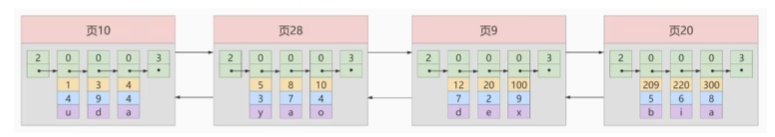
    那么有没有什么办法能只访问一次数据表就把我们想要招的数据找到呢？当然有！这就是索引最简单的设计。我们给每一个数据页都加上一个userId的索引，记录当前数据页的最小userId是多少，如下图所示
    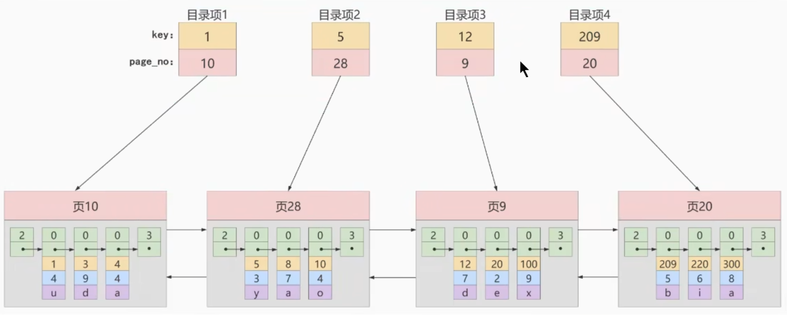
    这样，我们就能通过二分查找寻找到索引中的对应的数据页并访问了。在这种情况下，我们的磁盘I/O从$\log n$次降低为$2$次，一次从硬盘读取索引信息，一次读取数据表。

6. InnoDB的索引方案
    通过上面的讲解，似乎所有问题就解决了？当然不是！假如我们有很多的数据页的目录项呢？我们可以把所有的数据页目录都统一存放到一个数据表中，这个数据表中只存放对于某一个数据表的目录项。如图所示：
    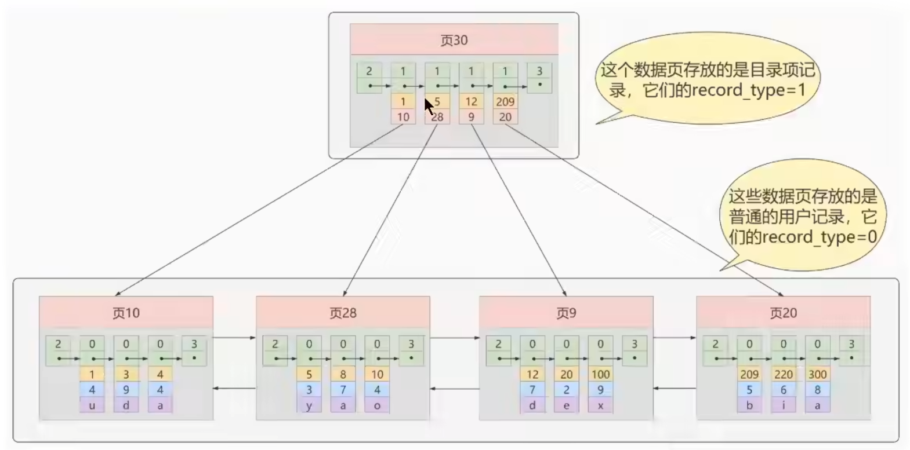
    实际上这就和我们在计算机操作系统中所学习的多级页表的概念是基本一样的。当我们的目录项数据页也变得多了起来的时候，我们同样需要再创建一层新的**目录的目录的数据页**

    最终，这一整个索引结构就变成了一棵树，这棵树就是B+ Tree
    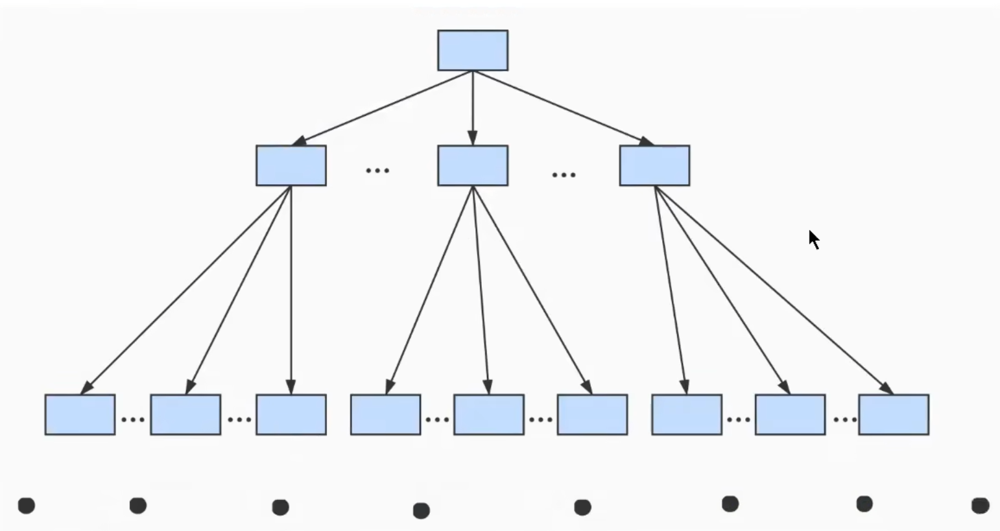
    这个树的叶子节点就是真正存储数据的数据页，而上面的节点都是用来存储索引信息的数据页。需要注意的是，MySQL的B+树的**所有叶子节点之间是通过双向链表连接**的，意味着跨数据页范围查找的情况下，不需要通过树的遍历方式查找下一个数据页，而是可以通过链表的访问方式进行访问。
    通常来说，这个B+树不会超过4层，意味着通过索引优化后，精确查询下磁盘的I/O次数不会超过4次！

#### 常见的索引概念
按照物理实现方式，索引可分为两种：**聚簇索引**和**非聚簇索引**。非聚簇索引又被成为二级索引或者辅助索引
1. 聚簇索引
    聚簇索引并不是一种单独的数据类型，而是一种**数据的存储方式**（所有的用户记录都存储在了叶子节点上）
    特点: 
    * 页内的记录是按照主键大小来进行排序的一个**单项链表**
    * 各个存放用户记录的页也是根据主键大小进行排序的**双向链表**
    * 处于同一层的目录页也是根据主键的大小进行排序的**双向链表**
    * B+Tree的叶子节点存储的是完整的用户记录，完整的用户记录指的是这个记录中存储了所有列的值，包括隐藏列
    
    优点: 
    * 数据访问更快，因为聚簇索引会把索引信息和数据信息存放到一棵树内
    * 聚簇索引对于主键的**排序查找**和**范围查找**速度非常快

    缺点:
    * **插入速度严重依赖于插入顺序**，如果插入的数据是按照索引是乱序的，则插入速度会很慢
    * 更新主键的代价很高，会导致被更新的行移动
    * B+Tree有多少层就需要多少次索引查找

    限制:
    * 由于数据物理存储排序方式只能有一种，所以每一个MySQL的表只能有一个聚簇索引，一般情况下就是这个表的主键。
    * 如果没有定义主键，Innodb会自动选择一个非空的唯一索引进行替代。如果没有，Innodb会隐式的定义一个主键来作为聚簇索引。

2. 非聚簇索引
    当我们想用非主键字段进行查找该怎么办呢，这时候就需要使用非聚簇索引了。 
    特点:
    * 目录页内的记录是按照某个特定的非主键字段进行排序的单项链表
    * 叶子节点不是用户数据页

**概念：回表**
根据非聚簇索引我们只能确定到我们要查找记录的主键的值，如果我们项根据非聚簇索引的列的值查找到完整的用户记录的话，仍然**需要到聚簇索引中根据获取的主键值再查一遍**，这个过程就被称为**回表**，也就是说根据非主键的值查询一条完整的用户数据**需要使用到2棵B+Tree**。

3. 联合索引
实际上联合索引就是非聚簇索引的一种，是一种同时为多个列建立索引的一种特别的非聚簇索引。假设我们想让B+Tree按照C2和C3两个列的大小进行排序，联合索引会：
    * 先把各个记录和页按照C2列进行排序
    * 在记录的C2值相同的情况下，采用C3列进行排序

#### InnoDB的B+Tree索引的注意事项
1. 根页面位置不会变化
在InnoDB中，实际上B+Tree的形成过程是这样的：
    * 每当为一个表创建一个B+Tree索引的时候，都会为这个索引创建一个根节点页面。最开始表中没有数据的时候，每一个B+Tree索引对应的根节点中既没有用户数据，也没有目录项记录
    * 随后向表中插入用户数据时，先把用户数据记录到这个根节点上
    * 当根节点中的可用空间用完时继续插入记录，此时会将根节点中的所有记录复制到一个新分配的页，比如`页A`中，然后对这个新页进行**页分裂**操作，得到一个新页，比如`页B`。此时新插入的记录根据键值的大小就会被分配到`页A`或者`页B`中，而根节点提升为目录页。
2. 内节点中目录项记录的唯一性
设想一个问题，如果我们的目录页中仅仅只存储了**索引列的值 + 下一页的指针**，如下图所示，我们可以看到，当我们向再次插入一条索引列值为1的数据的时候，我们就无法判断和决定这一条新数据应该存放在页4还是在页5中。
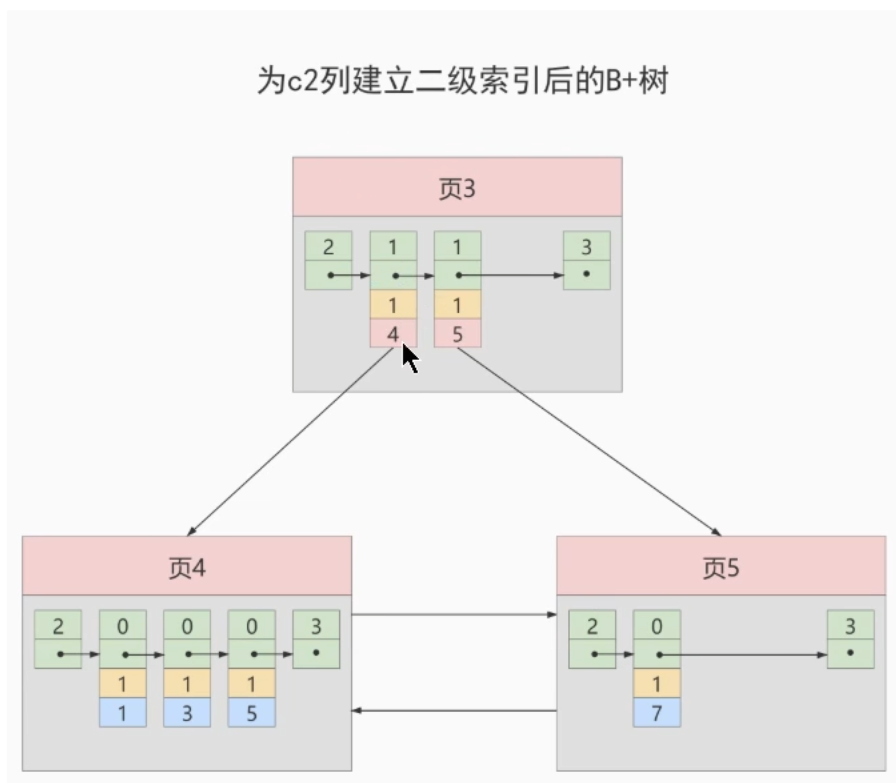
为了让新插入的记录能找到自己应该存放在哪一个页中，我们需要**保证B+Tree中同一层的节点内的项目记录除下一页的指针这个字段以外是唯一的。所以对于二级索引的内节点的目录项记录的内容实际上是由三个部分组成：
    * 索引列的值
    * 主键值
    * 下一页的指针

#### MyISAM中的索引方案
MyISAM存储引擎同样使用**B+Tree**作为索引结构，叶子节点的data field存放的是**数据记录的地址**。（因为在MyISAM中索引和数据是分开两个文件存放的）
由于是分开存放，所以在MyISAM中是没有聚簇索引的概念的。所有的索引都可以看作非聚簇索引。

#### 索引的代价
* 空间上的代价
    每建立一个索引都要为其建立一棵B+Tree，每一个B+Tree的每一个节点都是一个数据页，一个页会默认占用**16KB**的存储空间，一棵很大的B+Tree会由许多数据页组成，相当占用空间。
* 时间上的代价
    每次对表中的数据进行**增、删、改**操作的时候，都需要去修改各个B+Tree的索引。并且由于我们要维护树中数据的有序性，增删改操作可能会破坏节点的有序性，所以存储引擎就需要额外的时间进行一些**记录位移，页面分裂，页面回收等操作**，索引越多，额外付出的时间成本就更多。

#### MySQL数据结构选择的合理性
从MySQL的角度来说，选择数据结构的目标是为了让磁盘I/O的次数尽可能减少，因为相比于内存和CPU缓存，磁盘的速度非常的慢，这可能导致CPU因为等待资源时发生浪费。

1. 全表遍历: 从头开始顺序查找

2. Hash结构: 利用Hash函数直接计算位置，理想情况下时间复杂度为O(1)，
为什么Hash结构时间复杂度比B+树好，但是MySQL中不采用呢？
    * 当进行范围查询时，Hash结构会退化为O(n)，而B+树采用树形结构，依然能保证O(logn)的时间复杂度
    * Hash结构中数据的存储时没有顺序的，在使用`ORDER BY`的情况下需要对数据进行重新排序
    * 对于联合索引的情况，Hash值是将联合索引键合并后一起计算的，无法对单独的一个键或者几个索引进行查询
    * 虽然对于等值查询的情况来说，Hash索引效率更高，但如果我们数据库中重复索引很多，由于**哈希冲突**，我们需要将一个Bucket中的所有项一一比对后才能找到相应的数据项。

    **在MySQL中，只有Memory存储引擎是支持Hash索引的。**

    另外，InnoDB虽然不支持Hash索引，但是提供了**自适应Hash索引(Adaptive Hash Index)**。当存在一个数据经常被访问到，满足一定条件的情况下，就会将这个数据页存放到Hash表中，这样下次查询就可以直接找到这个页面所在的文职，也让B+树具备了Hash索引的优点。

3. 二叉搜索树: 最基本的二叉树，不保证平衡，性能与树的平衡度相关，最差情况下会退化成O(n)

4. AVL树: 平衡二叉搜索树，指的是一个树的左右子树的高度差绝对值不超过1，并且左右子树也是一棵AVL树

5. B树: Balance Tree，全程叫多路平衡查找树
B树的每一个阶段最多可能包括M个子节点，其中M称为B树的阶。每一个磁盘块中包括了**关键字**和**子节点的指针**。如果一个磁盘块中包括了X个关键字，那么指针书就是X+1。如下图所示
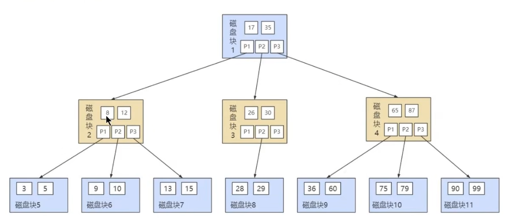
**与B+树相比，B树的非叶子节点中也是会存放数据的，就存放在关键字中，但由于在非叶子节点中同样存放了用户数据，所以B树的范围查找比起B+树而言更差**

6. B+树: 同样是多路平衡查找树，但对B树做出了改进，使其更适合文件索引系统。在此不过多介绍，相关内容可看上方介绍索引部分
为什么说B+树查找行记录最多只需要1-3次的磁盘I/O？
在InnoDB中数据页的大小为16KB，一般表的书简类型为INT（4 bytes）或者BIGINT（8 bytes），所保存的指针类型在64位操作系统中也为8 bytes，也就是说一个数据页我们大概能存下$Count_{catalog} = \frac{16KB}{8B + 8B} = 1K$个键值，当我们的B+树深度为3时，我们能存放的记录数量是$Count_{data} = 10^3 * 10^3 * 10^3 = 10^9$条。通常而言我们的B+树不会填满，因此在数据库中B+树的高度一般都是2-4层，而**MySQL的InnoDB中索引的根节点是常驻内存的**，也就是查找某一个键值的行记录最多只需要1-3次的磁盘I/O。

#### InnoDB中的数据存储结构
1. 数据库的存储结构: 页
在InnoDB，其将数据划分为若干个页，InnoDB中页的大小默认为**16KB**
磁盘与内存之间交互的基本单位就是页，也就是说一次最少从磁盘中读取16KB的数据到内存中，一次最少把16KB的数据写入内存中。一个页中可以存储多个行记录
数据页之间可以不在物理结构上相连(紧挨在一起)，只需要通过双向链表相关联即可

    另外在数据库中，才存在着**区(Extent)**，**段(Segment)**，和**表空间(Tablespace)**的概念，行、页、区、段、表空间的关系如下图所示:
    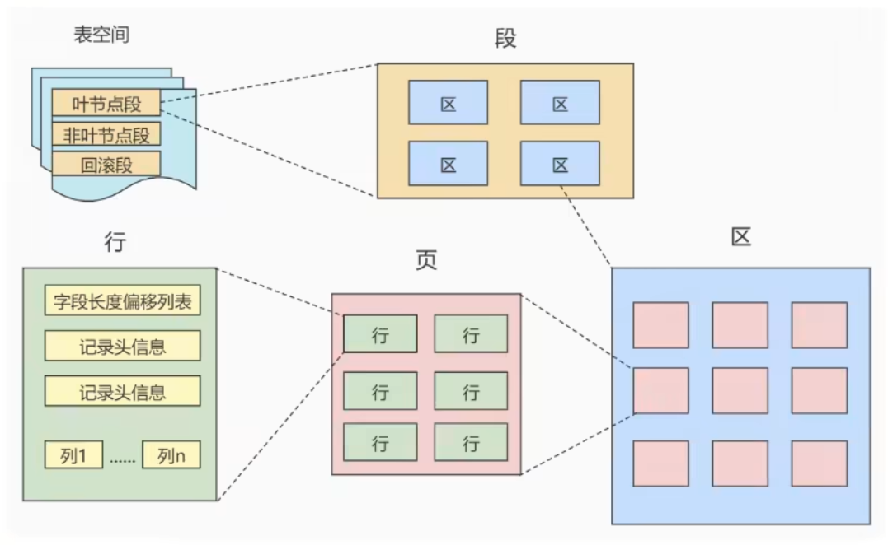
    * 区(Extent): 是比页大一级的存储结构，在InnoDB存储引擎中，一个区会分配**64个连续的页**。因为InnoDB中的页大小为16KB，所以一个区的大小是$16KB * 64 = 1MB$
    * 段(Segment): 由一个和多个区组成，区在系统文件是一个连续分配的空间，不过在段中不要求区与区之间是相邻的。**段是数据库的分配单位，不同类型的数据库对象以不同的段形式存在**
    * 表空间(Tablespace)是一个虚拟的容器，表空间存储的对象是段，从管理上能划分为**系统表空间**、**用户表空间**、**撤销表空间**、**临时表空间**。

2. 页的内部结构
页按照类型划分的话，常见的由**数据页(保存B+树节点)**、**系统页**、**Undo页**和**事务数据页**等。数据页是最常使用的页。
数据页的16KB大小被划分成了7个部分，分别是**文件头(File Header)**、**页头(Page Header)**、**最大最小记录(Infimum+supremum)**、**用户记录(User Records)**、**空闲空间(Free Space)**、**页目录(Page Directory)**、**文件尾(File Tailer)**
    
    
    a. 文件头(File Header)(38 Bytes)
    | 名称 | 占用空间大小 | 描述 |
    | ---- | ---------- | ---- |
    | `FIL_PAGE_SPACE_OR_CHKSUM` | `4B` | 页的校验和 |
    | `FIL_PAGE_OFFSET` | `4B` | 页号(全局唯一) |
    | `FIL_PAGE_PREV` | `4B` | 上一页的页号 |
    | `FIL_PAGE_NEXT` | `4B` | 下一页的页号 |
    | `FIL_PAGE_LSN` | `8B` | 页面最后修改时对应的日志序列位置，英文是: Log Sequence Number |
    | `FIL_PAGE_TYPE` | `2B` | 该页的类型 |
    | `FIL_PAGE_FILE_FLUSH_LSN` | `8B` | 尽在系统表空间的一个页中定义，代表文件至少被刷新到对应的LSN值 |
    | `FIL_PAGE_ARCH_LOG_NO_OR_SPACE_ID` | `4B` | 页属于哪一个表空间 |

    b. 文件尾(File Tailer)(8 bytes)
    | 名称 | 占用空间大小 | 描述 |
    | ---- | ---------- | ---- |
    | `FIL_PAGE_SPACE_OR_CHKSUM` | `4B` | 页的校验和 |
    | `FIL_PAGE_LSN` | `4B` | 页面最后被修改时对应的日志序列位置(LSN) |·

    c. 


在一个数据页中，所存放的数据行是通过链表组织起来的，但是折又会存在一个问题，就是即使我们的链表是有序的，但我们无法使用二分查找加速搜索过程。实际上，在每一个页中都存在一个页目录，使用数组结构，用于快速定位元素


### MySQL 事务(Transaction)

### MySQL 日志与备份