# 虚幻引擎中的AI行为树

### 行为树中的基本概念
1. Composite
2. Task

### 基本的数据结构
在虚幻引擎的AI行为树中，我们经常会使用到的数据结构有三种，分别是：
* BehaviorTree
    AI行为树的本身，里面是一个树状结构，是用来指导Pawn根据情况进行行为的数据结构。
    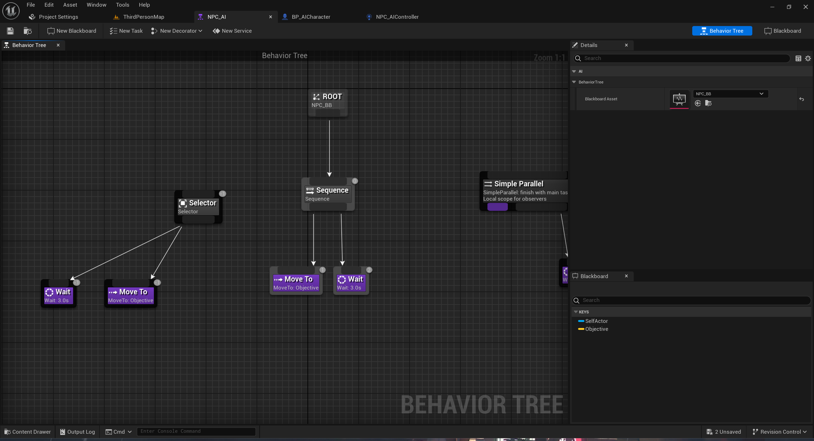
* Blackboard
    Blackboard是一个用来存放和AI行为树相关数据的一个存储数据结构，每一个AI行为树都要和一个Blackboard绑定。
    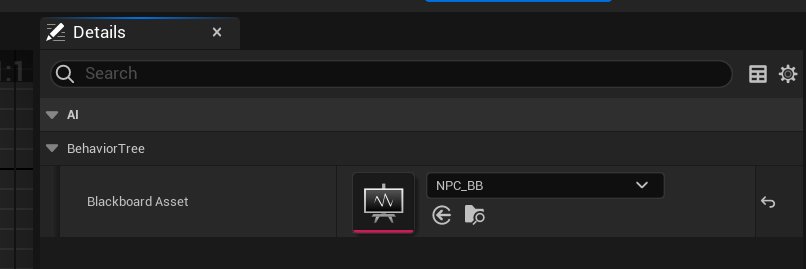
* AIController
    AIController(AI控制器)是一个类似于PlayerController的一个东西，一个Pawn需要一个Controller才能被控制然后动起来，玩家所表示的是PlayerController，而需要使用AI的话，AIBehaviorTree就像另外一个玩家一样，通过一个AIController对Pawn进行控制。

### Behavior Tree中的三种Composites(复合体)
1. **Selector**
    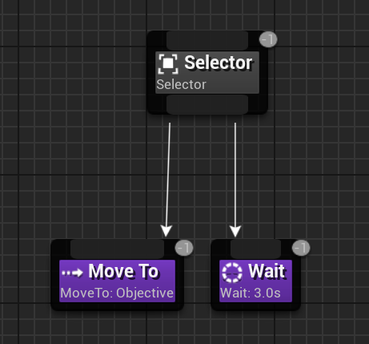
    Selector表示一个选择器，会一直执行从左到右的第一个成功的Task，执行完成后直接结束且再次重头开始选择第一个成功的Task。
    如上图所示：
    * 假设这两个任务都能正常运行，那么像是在图中一样的排列方式，Selector首先会尝试运行`Move To`任务，并且成功，那么这次的运行就会在`Move To`成功后停止。
    * 假设我们的`Move To`任务由于Objective并没有被设置从而导致执行失败，那么Selector会选择按顺序下来的第二个任务，也就是`Wait`任务，所以角色会在原地等待三秒。

2. **Sequence**
    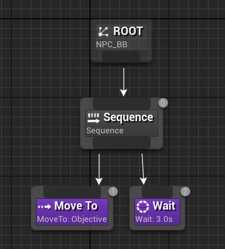
    Sequence表示一个顺序执行器，会从左到右依次执行所有的任务，如果中间的一个任务失败，则会返回到最开始的任务重新开始执行，放弃后面任务的执行。对于图中的情况，假设我们第一个任务`Move To`失败了，那么Sequence会不断的尝试执行`Move To`任务直到成功而不是跳过`Move To`尝试执行`Wait`任务，也就是说**在中间存在任务失败的情况下，后续的任务不会被执行**。

3. **Simple Parallel**
    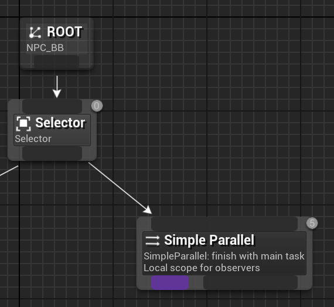
    我们可以从途中看到这个节点存在两个子节点，顾名思义，就是这两个子节点会并行运行。其中，左边紫色的那个子节点只能连接Task，而右边那个灰色就和Selector和Sequence的子节点一样，可以再套一层Composites。
    在默认情况在，左侧任务结束的时候并不会管右侧任务是否已经完成，而是会立刻终止。我们可以通过Simple Parallel节点的Finish Mode来修改，将其从`Immediate`改成`Delayed`，此时Simple Parallel就只会在左右两侧的两个任务都完成之后才会结束任务了。

### 自定义Task
在UE的行为树中，除了官方给我们提供的任务外，我们还可以自定义新任务，通过在AI行为树界面的左上角中的New Task按钮，我们可以创建一个新的Task
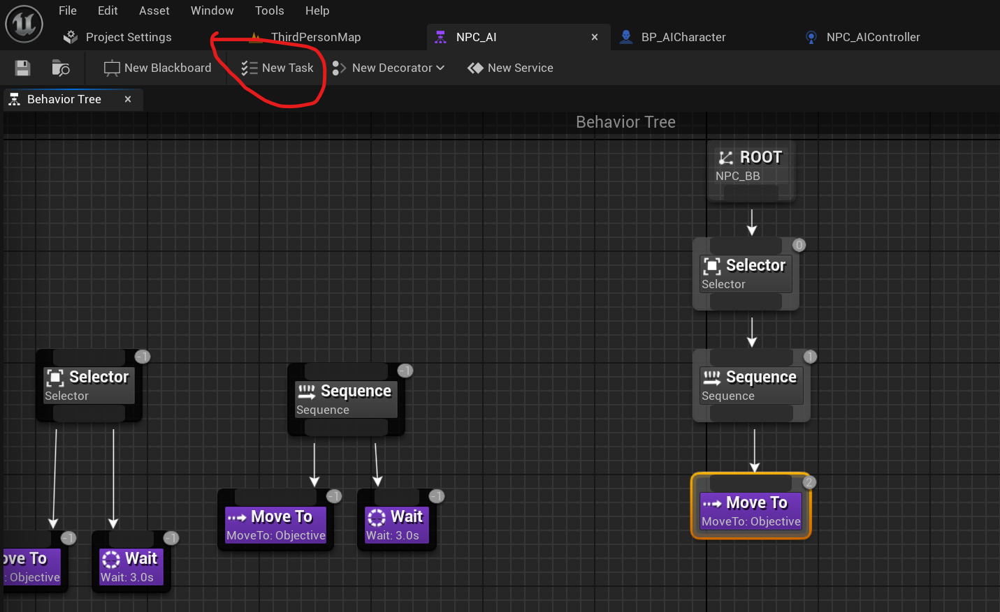
默认任务的编辑界面就是标准的蓝图界面
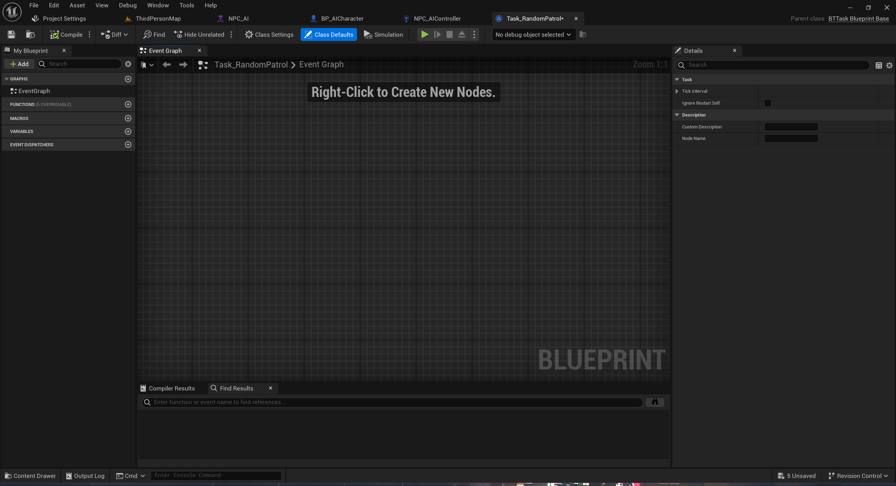
在这个蓝图中，我们能重载的函数有6个：
1. Receive Abort
2. Receive Abort AI
3. Receive Execute
    当在AI行为树接收到执行任务时出触发，是一个更加通用的函数，可以在Pawn不试用AIController的时候触发这个函数。(我目前没有想到这个函数具体有什么作用)

4. Receive Execute AI
    当在AI行为树中接收到执行任务时触发，专门用于AI控制器，也就是说如果一个Pawn没有被AIController控制的话，那么拥有这个行为树的Pawn即使执行了当前的任务也不会触发这个函数。

5. Receive Tick
6. Receive Tick AI

#### 在自定义的Task中和黑板中的变量进行设置和获取
在Customized Task中，我们可以设置和获取黑板中的变量，帮助我们的自定义Task能更好的控制Pawn
1. 获取
2. 设置
    在自定义的Task中，我们可以通过在蓝图中创建`Blackboard Key Selector`的类型变量然后在AI行为树中进行绑定从而达到设置黑板中值的效果。
    举个例子：
    假设我们想要在自定义Task中获取一个随机的Location，然后让我们的Pawn移动过去，整个行为树如下图所示，我们需要在这个`Task_RandomPatrol`任务中找到下一个要移动的点。
    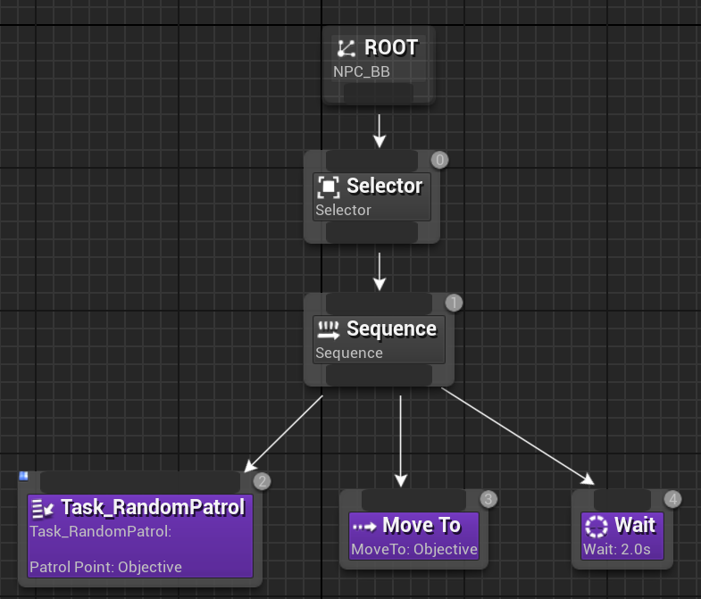
    在`Task_RandomPatrol`的蓝图中，我们首先创建一个叫做`PatrolPoint`的参数，类型为`Blackboard Key Selector`，并且将其设置为public。
    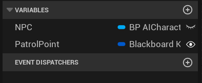
    随后，我们需要覆写`Receive Execute AI`这个函数，然后根据函数传入的参数`Controlled Pawn`的Location，调用蓝图节点`GetRandomLocationInNavigableRadius`，传入对应的参数，找到距离当前Pawn周围固定半径的可导航点，**随后我们以获取的形式拉出我们的`PatrolPoint`变量，将其作为参数调用函数`Set Blackboard Value as Vector`(因为Location信息是一个Vector)，在设置完成后，调用`Finish Execute`节点完成任务的执行，并且将Success参数设置为true，蓝图的设置如下所示：
    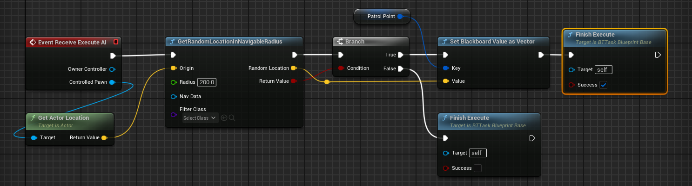
    最后，在行为树中将我们的PatrolPoint变量与黑板中对应的变量进行绑定，我们在行为树中选定Task_RandomPatrol节点，在右边的Detail面板中就能看到暴露出来的PatrolPoint了，在这里我绑定到一个叫做`Objective`的变量中了，类型也是`Vector`。
    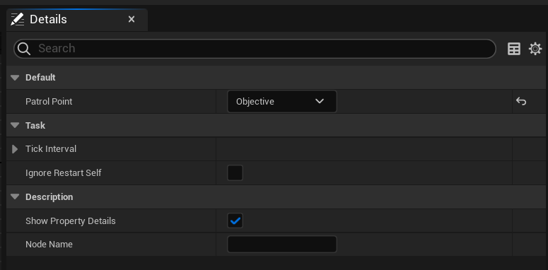

### Task装饰器

### Task服务